# x) Lue/katso/kuuntele ja tiivistä. (Tässä x-alakohdassa ei tarvitse tehdä testejä tietokoneella, vain lukeminen tai kuunteleminen ja tiivistelmä riittää. Tiivistämiseen riittää muutama ranskalainen viiva. Kannataa lisätä kustakin oma huomio, idea tai kysymys.)

  Herrasmieshakkerit (RSS) tai Darknet Diaries (RSS) , yksi vapaavalintainen jakso jommasta kummasta. Voi kuunnella myös lenkillä, pyykiä viikatessa tms. Siisti koti / hyvä kunto kaupan päälle.

Kuuntelin darknet diaries jakso 61. Siinä haastateltiin Samy Kamkaria.

- Hän alkoi kiinnostumaan tietokoneista nuorena ja alotti hakkeroimisesn Counter-Strikestä
- Hänet palkattiin koodariksi kirjoittamieen huijauskoodin avulla, mutta kyllästyi perustyöhön ja alkoi hakkeroimaan MySpacea
- Samy löysi tavan ajaa javascriptiä kun joku käy Samyn profiilissä, tämä koodi kopioitui käyjän sivulle joten se levisi ympäri MySpacea
- Hän jäi kiinni ja sai muutaman vuoden ehtoollista vankeutta
- Kakun suoritettuaan hän vieläkin hakkeroi, mutta nyt eettisesti. Hänellä on oma blogi, jossa hän kertoo löytämistää haavoittuvaisuuksista jotta muut pysyisivät suojassa
- Tässä on muutama Samyn projekti, jota hän on tehnyt ehdonalaisen jälkeen https://github.com/samyk/evercookie https://github.com/samyk/poisontap https://github.com/samyk/skyjack

(Lähteet https://darknetdiaries.com/episode/61/, https://github.com/samyk/evercookie, https://github.com/samyk/poisontap)
    
  Hutchins et al 2011: Intelligence-Driven Computer Network Defense Informed by Analysis of Adversary Campaigns and Intrusion Kill Chains, chapters Abstract, 3.2 Intrusion Kill Chain.

  
  € Santos et al: The Art of Hacking (Video Collection): 4.3 Surveying Essential Tools for Active Reconnaissance. Sisältää porttiskannauksen. 5 videota, yhteensä noin 20 min.

- Ketju koostuu seitsemästä vaiheesta: Tiedustelu (Reconnaissance), Aseistus (Weaponization), Toimitus (Delivery), Hyväksikäyttö (Exploitation), Asennus (Installation), Käsky ja hallinta (Command and Control C2), Tavoitteiden toteutus (Actions on Objectives)
- Hyökkääjän pitää käydä nämä kaikki ketjun vaiheet läpi järjestyksessä, jotta pääsee aiheuttamaan vauriota
- Näiden vaiheiden ymmärtäminen ja tunnistaminen antaa edun puolustajille vaikkakin hyökkääjä käyttäisi uutta tai zero day haavoittuvuutta.

  - Videossa puhutaan porttiskannauksesta ja siihen liittyviä työkaluja
  - Nmap (yleisin ja yleisesti hyvä monissa eri tilanteissa), Masscan ( ei niin yksityiskohtainen kun nmap, pystyy skannatta nopeasti paljon) ja udpprotoskanner( nopea UDP porttiskannaja)
  - Demossa käytiin läpi nmapin, masscannin ja udproton syntaksia ja eri annettaville parametrejä
  - lopussa näytettiin ohjelman EyeWitness käyttöä, jolla voi käydä läpi nopeasti monta verkkosivua, jolla voi rajata vähemmän tärkeitä sivuja pois ja keskittään huomion olellisiin
  
  
KKO 2003:36. (Vain silmäily, ei tarvitse lukea kokonaan eikä varsinkaan tehdä syvällistä analyysia).

  - Tekijä oli porttiskannannut OP-pankin järjestelmän ja jäi siitä kiinni
  - Asian käsittelyssä kesti vuosia ja teon tekijä joutui maksamaan yhteensä korvauksina 75 000 markkaa

# a) Asenna Kali virtuaalikoneeseen. (Jos asennuksessa ei ole mitään ongelmia tai olet asentanut jo aiemmin, tarkkaa raporttia tästä alakohdasta ei tarvita. Kerro silloin kuitenkin, mikä versio ja millä asennustavalla. Jos on ongelmia, niin tarkka ja toistettava raportti).

- Kalin asennuksessa ei ollut ongelmia, asensin sen tämän version virtualboxiin

# b) Irrota Kali-virtuaalikone verkosta. Todista testein, että kone ei saa yhteyttä Internetiin (esim. 'ping 8.8.8.8')

Testasin nettiyhteyttä itselleni tutulla ja myös tunnilla opetetulla tavalla eli komennolla

      ping 8.8.8.8

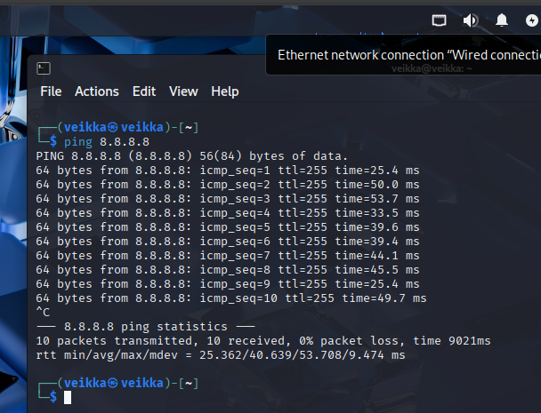

Verkko on päällä

Seuraavaksi laitoin sen pois päältä painamalla disconnect

Sitten ajoin komennon uudestaan

Tuli network unreachable eli verkkoon ei pääse tällä hetkellä

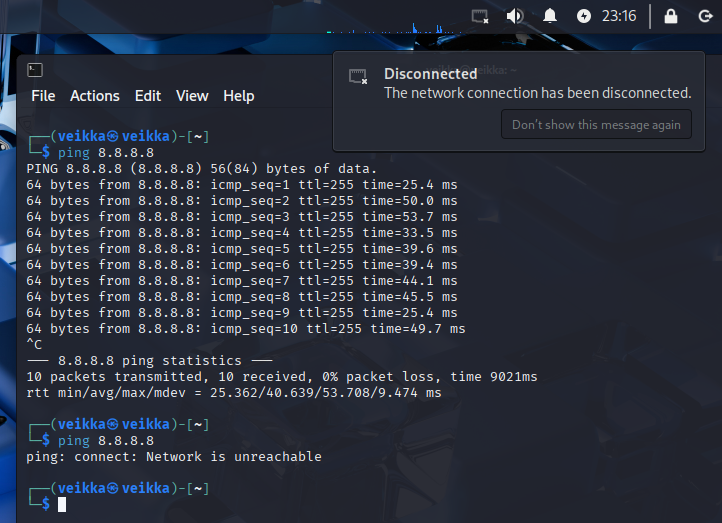 

# c) Porttiskannaa 1000 tavallisinta tcp-porttia omasta koneestasi (nmap -T4 -A localhost). Selitä komennon paramterit. Analysoi ja selitä tulokset.

 Tiesin jo etukäteen että Kalissa on valmiiksi asennettu nmap ( sen voi tarkistaa komennolla nmap -version joka näyttää sen version jos se on asennettu)
 Netti on vielä pois päältä edellisen askeleen jälkeen joten voi alkaa porttiskannailla OMAA KONETTA. Ajoin

         nmap -T4 -A localhost

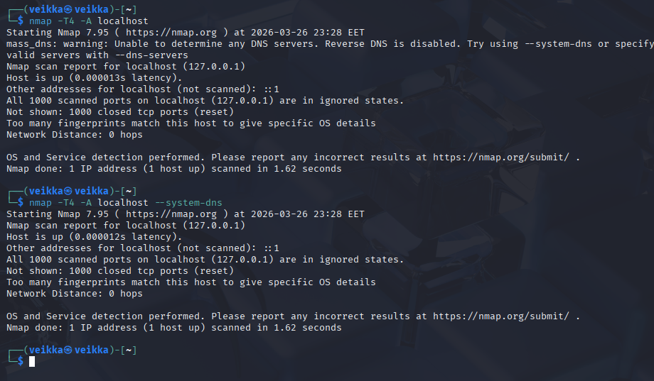

Komennon parametrit:

nmap: käynnistää nmapin

-T4: skannauksen aggressiivisuus/nopeus. Se on asteikolla 1-5 eli 4 on toiseksi nopein asetus

-A: version löytäminen esim. käyttöjärjestelmän ja sen version skannaus lisättynä tuloksiin

localhost: localhost eli paikallinen kone, nmap skannaa käyttäjän oman koneen.

Not shown: 1000 closed tcp ports (reset): skannaus ei näytä 1000 suljettua porttia

Host is up (0.000012s latency): kone on pystyssä

Network Distance: 0 hops: 0 hyppyä verkkoja, koska skannataan omaa konetta

Too many fingerprints match this host to give specific OS details: nmap ei kykene antaa tarkempia tietoja nykyisillä parametreillä

Host is up (0.000012s latency): kohde on ylhäällä

Nmap done: 1 IP address (1 host up) scanned in 1.62 seconds: 1 ip-osoite(jonka kone on pystyssä) skannattu 1.62 sekunnissa

# d) Asenna kaksi vapaavalintaista demonia ja skannaa uudelleen. Analysoi ja selitä erot.

Asensin mariadb ja nginx demonit

      sudo apt install mariadb-server
      sudo apt install nginx

Sekä käynnistin ne komennoilla

      sudo systemctl start mariadb
      sudo systemctl start nginx

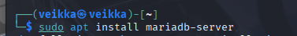

Ajoin saman porttiskannauksen

         nmap -T4 -A localhost
         

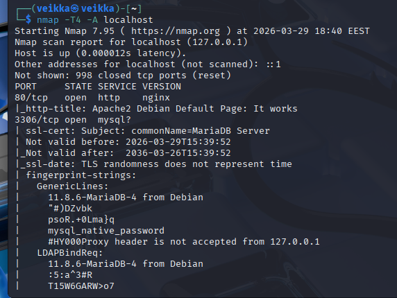

Siellä olipas kaksi porttia auki kun aikaisemmin kaikki olivat kiinni

portti 80: juuri asennettu nginx

portti 3306: mysql?, jonka nmap epäilee sen olevan mariadb (tässä tapauksessa tiesin että se on mariadb, koska itse sen asensin)

Tästä opin, että jos asentaa demonin ja laittaa sen päälle sen portti on auki, joka on hyviä uutisia mahdolliselle uhlatekijälle. Demonia asentelussa pitää olla siis tarkkaavainen

# e) Ratkaise vapaavalintainen kone HackTheBoxista. Omalle tasolle sopiva, useimmille varmaan Starting Pointista. Valitse kone, jota et ole ratkaissut vielä. Ei tunnilla näytetty Meow. (Propellihatuille: jos teet vaikeampia ei-starting-point koneita, niin retired tai vastaava kone, josta saa julkaista writeupin).

Päätin valita koneen Redeemer ja sen ip tälle instanssille on 10.129.55.64

1. kysymys mikä TCP-portti on auki koneella

Tässä pitää vain skannata portit koneelta (man sivuilla oli --min-rate parametri, joka nopeuttaa skannausta)

       nmap --min-rate 5000 -p- 10.129.55.64

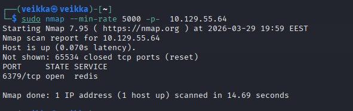

Eli vastaus on portti 6379

2. mikä palvelu pöyrii auki olevalla portilla

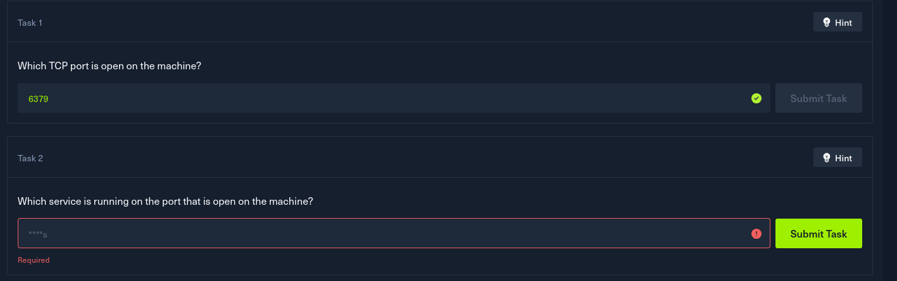

vastaus näkyi porttiskannaus tuloksessa eli redis

3. Minkä tyyppinen tietokanta redis on, in-memory vai perinteinen

vastaus löytyi googlettamalla niiden omasta github reposta  https://github.com/redis/redis

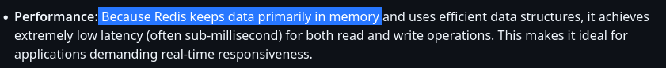

4.

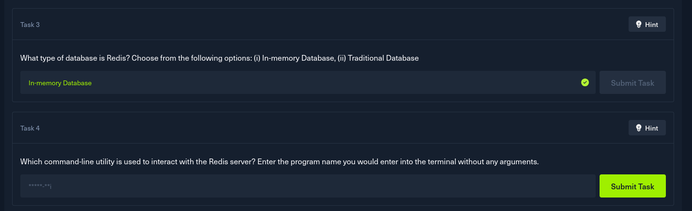

Vastaus: redis-cli, löytyy mm. reposta https://github.com/redis/redis?tab=readme-ov-file#using-redis-with-redis-cli

5. 

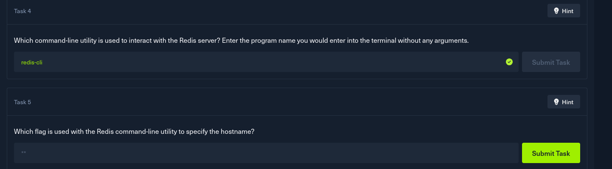

vastaus: -h, löytyi https://redis.io/docs/latest/develop/tools/cli/ 

6.
 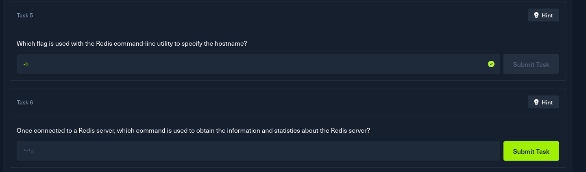

vastaus: info, kokeilin arvaamalla se näkyi että se loppui o kirjaimeen ja info tai sen tyyppinen ovat melko yleisiä komentoja

7. 
    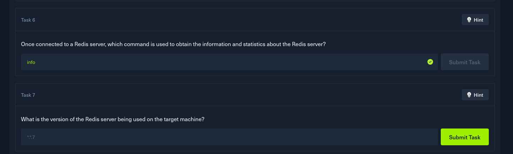

vastaus: lisäsin porttiskannaukseen -A flagin eli versio skannauksen

    nmap --min-rate 5000 -A -p- 10.129.55.64

josta paljastui, että versio on 5.0.7

8. 

 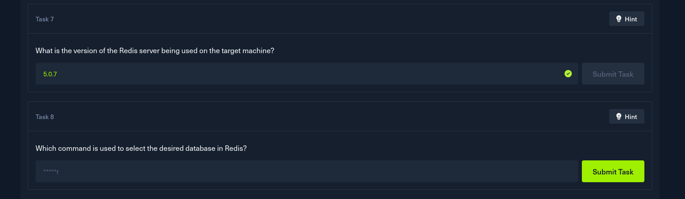

 vastaus: SQL:ssä on select niin kokeilin sitä ennen kuin lähdin googlaamaan liikaa, sehän oli select

9.

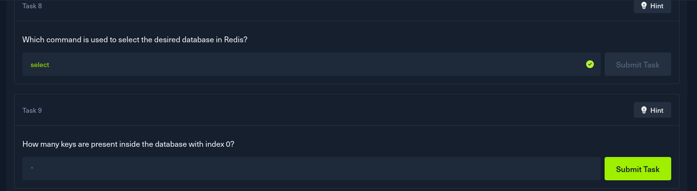

vastaus: Asensin tässä vaiheessa rediksen

    sudo apt install redis

Aikaisemmissa kysymyksissä tehtii tiedustelua kohdekonessa on auki portti 6379 joka on rediksen oletus portti. Tämä tarkoittaa että siihen voi otta yhteyden sillä eli

    redis-cli -h 10.129.55.64

 

Pääsin koneen sisälle redikseen ja sain vastauksen info komennolla 

 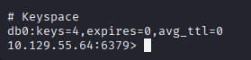

 eli avaimia on 4

10.

 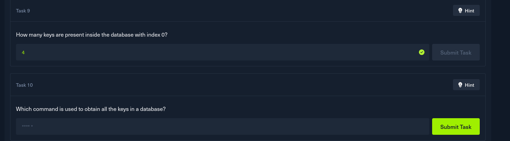

 vastaus: googlesta löytyi monta hyvää tulosta  esim https://last9.io/blog/retrieving-all-keys-in-redis/

 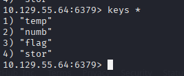
 

 eli     

       keys * 

Viimeisernä on Flag.

Vastaus: yksi avaimista on flag, sen saa get-pyynnöllä

 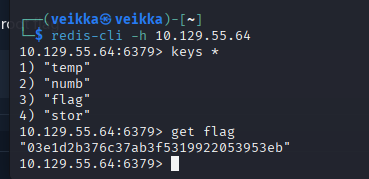

eli flag on 03e1d2b376c37ab3f5319922053953eb

Ja näin tuli tehtyä Redeemer loppuun

 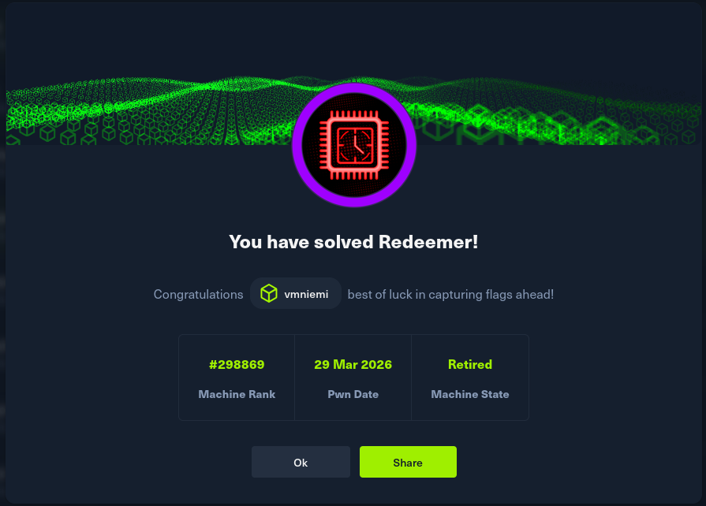

      

## Lähteet

https://terokarvinen.com/tunkeutumistestaus/

https://finlex.fi/fi/oikeus/kko/kko/2003/20030036

https://learning.oreilly.com/videos/the-art-of/9780135767849/9780135767849-SPTT_04_00 

https://lockheedmartin.com/content/dam/lockheed-martin/rms/documents/cyber/LM-White-Paper-Intel-Driven-Defense.pdf

https://darknetdiaries.com/episode/61/

https://github.com/samyk/evercookie

https://github.com/samyk/poisontap

nmap man-sivut

https://github.com/redis/redis

https://github.com/redis/redis?tab=readme-ov-file#using-redis-with-redis-cli

https://last9.io/blog/retrieving-all-keys-in-redis/
