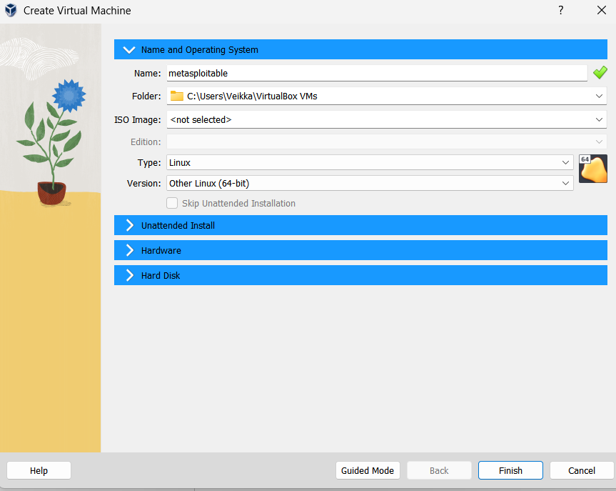
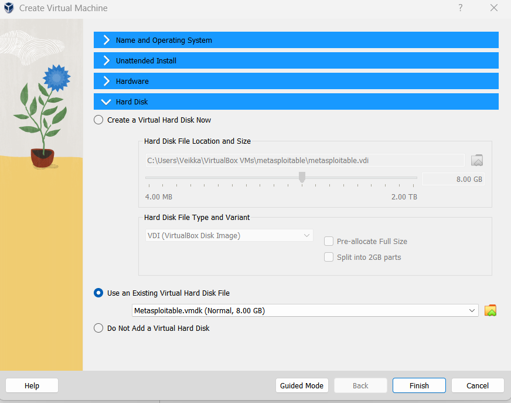
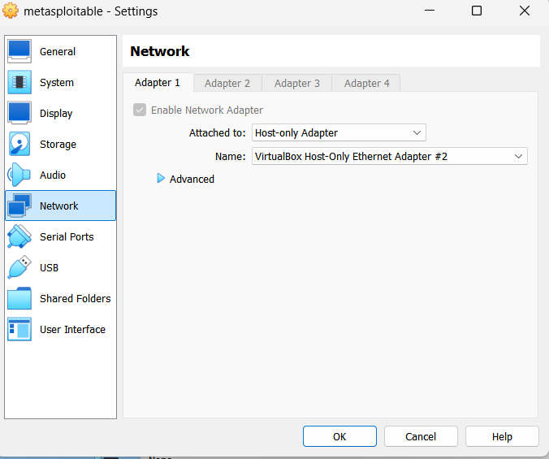
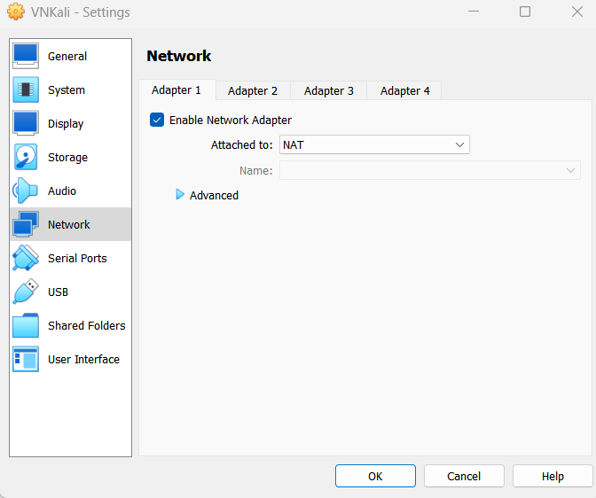
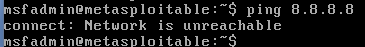
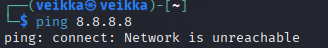
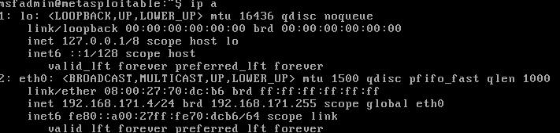
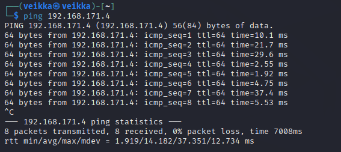

## x) Lue/katso/kuuntele ja tiivistä. (Tässä x-alakohdassa ei tarvitse tehdä testejä tietokoneella, vain lukeminen tai kuunteleminen ja tiivistelmä riittää. Tiivistämiseen riittää muutama ranskalainen viiva. Lisää mukaan jokin oma havainto, idea tai kysymys)
# Buuri 2026: DORA and TLPT testing - Lecture for Haaga-Helia on 31 March 2026 (pdf, 2 MB)
# DORA (Regulation ... on digital operational resilience for the financial sector) (vain nämä kaksi artiklaa):
# Article 26 "Advanced testing of ICT tools, systems and processes based on TLPT" Article 27 "Requirements for testers for the carrying out of TLPT"

# TIBER-FI procedures and guidelines (pdf, 1 MB) (vain tämä kohta):5.4 Testing phase: Red team testing (johdantokappale suoraan 5.4 alta, "5.4.1 Red team test plan creation" alkuun asti)

## a) Asenna Metasploitable 2 virtuaalikoneeseen.

Seurasin tämän ohjeita metasploitable asennuksessa: https://medium.com/cyber-collective/setting-up-metasploitable-in-virtualbox-on-kali-linux-1d5c3212f7f3 

Latasin Metasploitable 2 tästä sivulta: https://www.rapid7.com/products/metasploit/metasploitable/

Sitten menin oracle virtualboxiin ja painoin new nappia jotta sain tehtyä uuden koneen.

Laitoin nämä asetukset ensimmäiseen tabiin

Sitten menin specify virtual hard disk, laitoin use existing virtual hard disk file ja pistin siihen ladatun Metasploitable2.vmdk tiedoston ja painoin finish.

Lopuksi käynnistin metasploitablen tarkastukseksi, että se toimii:

Kone käynnistyin ja pääsin kirjautumaan sisään

## b) Tee Kalin ja Metasploitablen välille virtuaaliverkko. Jos säätelet VirtualBoxista- Kali saa yhteyden Internettiin, mutta sen voi laittaa pois päältä - Kalin ja Metasploitablen välillä on host-only network, niin että porttiskannatessa ym. koneet on eristetty intenetistä, mutta ne saavat yhteyden toisiinsa

Laitoin metasploitableen host-only adapterin

Sitten menin olemassa olevaan kalin network asetuksiin

Siellä on adapteri 1 joka on NAT:ssa 

Lisäsin adapteri 2:sen joka on host-only adapter

  
## c) Harjoittelemme omassa virtuaaliverkossa, jossa on Kali ja Metaspoitable. Osoita testein, että 1) koneet eivät saa yhteyttä Internetiin 2) Koneet saavat yhteyden toisiinsa.

Pingasin ensin metasploitin koneella googlea 8.8.8.8

Sitten kalilla sama

Koneet eivät siis saa yhteyttä nettiin.

Sitten vielä testaus, että kalini ja metasploit saa yhteyden toisiinsa

Sain metasploitin ip-osoitteen komennolla 

    ip -a

Se on tässä tapauksessa 192.168.171.4

Pingasin sitä

      ping 192.168.171.4

Ne menivät perille

Testasin varmuudeksi toistepäin eli pingasin kalia metasploitista

Sain kalini ip-osoitteen samalla komennolla (ip -a), se olikin 192.168.171.3

Pingasin sitä osoitetta

Kaikki menivät perille eli koneet saavat yhteyden toisiinsa molempiin suuntiin

## d) Etsi Metasploitable porttiskannaamalla (nmap -sn). Tarkista selaimella, että löysit oikean IP:n - Metasploitablen weppipalvelimen etusivulla lukee Metasploitable.

## e) Porttiskannaa Metasploitable huolellisesti ja kaikki portit (nmap -A -T4 -p-). Poimi 2-3 hyökkääjälle kiinnostavinta porttia. Analysoi ja selitä tulokset näiden porttien osalta. Voit hakea analyysin tueksi tietoa verkosta, muista merkitä lähteet.

f) Vapaaehtoinen bonus: Sisään vaan. Pääsetkö murtautumaan Metasploitableen?
g) Vapaaehtoinen bonus: jos haluat, voit jo kokeilla metasploit-hyökkäysohjelmaa omaan harjoitusmaaliisi. Tätä katsotaan myöhemmin yhdessäkin. (Muista irrottaa kone Internetistä kokeilujen ajaksi. 'sudo msfdb init', 'sudo msfconsole').

## Lähteet 

https://terokarvinen.com/tunkeutumistestaus

https://terokarvinen.com/buuri-2026-dora-and-threat-lead-penetration-testing/buuri-2026-dora-and-threat-lead-penetration-testing--teros-pentest-course.pdf

https://eur-lex.europa.eu/eli/reg/2022/2554/oj/eng

https://medium.com/cyber-collective/setting-up-metasploitable-in-virtualbox-on-kali-linux-1d5c3212f7f3

https://www.rapid7.com/products/metasploit/metasploitable/
