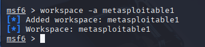
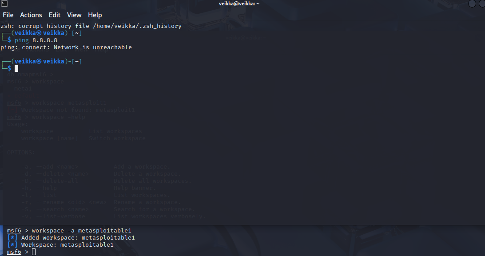

## x) Lue/katso/kuuntele ja tiivistä. (Tässä x-alakohdassa ei tarvitse tehdä testejä tietokoneella, vain lukeminen tai kuunteleminen ja tiivistelmä riittää. Tiivistämiseen riittää muutama ranskalainen viiva.)

€ Jaswal 2020: Mastering Metasploit - 4ed: Chapter 1: Approaching a Penetration Test Using Metasploit (kohdasta Conducting a penetration test with Metasploit luvun loppuun eli "Summary" loppuun)

Mitä 'nmap -sn' tekee? Älä arvaa, vaan perustele lähteillä. Mistä tiedät, että käyttämäsi lähde on luotettava?

## b) Tallenna porttiskannauksen tuloksia Metasploitin tietokantoihin. Skannaa niin, että Metasploitable tulee mukaan. Kannattaa ottaa mukaan ainakin versioskannaus -sV (joka on banner grabbing plus)

Käynnistin loin metasploitttin tietokannan 

      sudo msfdb init

Käynnistin konsolin

      sudo msfconsole

Tein vielä uuden workspace komennolla 

    workspace -a metasploitable1

Avasin uuden terminaali ikkunan pingasin varmuudeksi ettei kone pääse nettiin

Tämän jälkeen voidaan tehdä porttiskannaus

    db_map 192.168.171.4 -sV -T4

## c) Tarkastele Metasploitin tietokantoihin tallennettuja tietoja komennoilla "hosts" ja "services". Kokeile suodattaa näitä listoja tai hakea niistä.

## d) Internet famous. Etsi Metasploitablen mukana tulevista hyökkäyksistä (en: exploits; search) sellainen, joka on ollut julkisuudessa.

## e) Vertaile nmap:n omaa tiedostoon tallennusta (-oA foo) ja db_nmap:n tallennusta tietokantoihin. Mitkä ovat eri tiedostomuotojen ja Metasploitin tietokannan hyvät puolet?

## f) Murtaudu Metasploitablen vsftpd-palveluun

## g) Kerää levittäytymisessä (lateral movement) tarvittavaa tietoa metasploitablesta. Analysoi tiedot. Selitä, miten niitä voisi hyödyntää.

## h) Murtaudu Metasploitableen jollain toisella tavalla. (Jos tämä kohta on vaikea, voit tarvittaessa turvautua verkosta löytyviin läpikävelyohjeisiin. Merkitse silloin raporttiin, missä määrin tarvitsit niitä).

## i) Demonstroi Meterpretrin ominaisuuksia.

## j) Tallenna shell-sessio tekstitiedostoon script-työkalulla (script -fa log001.txt) tai tmux:lla
.
## k) Pivot point. Laita kaikki harjoituksen tiedostot (script -fa, nmap -oA...) samaan kansioon. Hae sopiva pivot point (sovellus, versio, osoite, MAC-numero) 'grep -r' -komennolla. Keksi uskottava esimerkkikysymys, johon haet vastausta.

## l) Attaaack! Mitä Mitre Attack taktiikoita ja tekniikoita käytit tässä harjoituksessa? (Tässä alakohdassa "Attaack!" ei tarvitse tehdä lisää testejä koneella, koska testit on jo tehty.)
