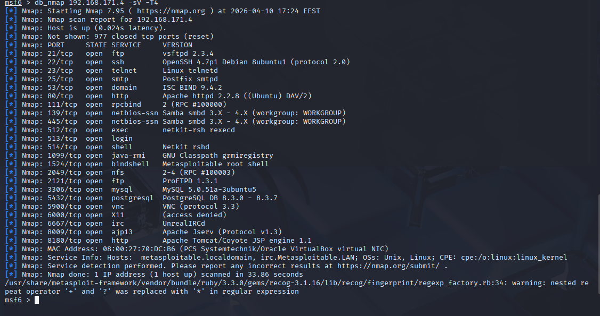
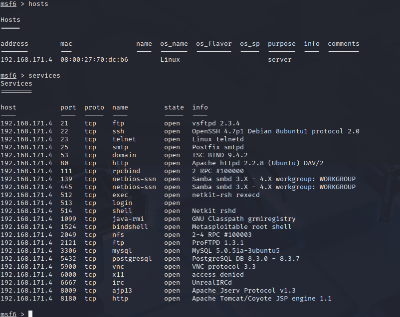

## x) Lue/katso/kuuntele ja tiivistä. (Tässä x-alakohdassa ei tarvitse tehdä testejä tietokoneella, vain lukeminen tai kuunteleminen ja tiivistelmä riittää. Tiivistämiseen riittää muutama ranskalainen viiva.)

€ Jaswal 2020: Mastering Metasploit - 4ed: Chapter 1: Approaching a Penetration Test Using Metasploit (kohdasta Conducting a penetration test with Metasploit luvun loppuun eli "Summary" loppuun)

Mitä 'nmap -sn' tekee? Älä arvaa, vaan perustele lähteillä. Mistä tiedät, että käyttämäsi lähde on luotettava?

## b) Tallenna porttiskannauksen tuloksia Metasploitin tietokantoihin. Skannaa niin, että Metasploitable tulee mukaan. Kannattaa ottaa mukaan ainakin versioskannaus -sV (joka on banner grabbing plus)

Käynnistin loin metasploitttin tietokannan 

      sudo msfdb init

Käynnistin konsolin

      sudo msfconsole

Tein vielä uuden workspace komennolla 

    workspace -a metasploitable1

Avasin uuden terminaali ikkunan pingasin varmuudeksi ettei kone pääse nettiin

Tämän jälkeen voidaan tehdä porttiskannaus

    db_map 192.168.171.4 -sV -T4

## c) Tarkastele Metasploitin tietokantoihin tallennettuja tietoja komennoilla "hosts" ja "services". Kokeile suodattaa näitä listoja tai hakea niistä.

komento hosts näyttää mm. skannattujen laitteiden ip-osoitteet, MAC-osoitteet ja käyttö järjestelmän nimen

Komento Services näyttää kaikki skannatut palvelut ja niiden nimet, protokollat, portit ja niiden tilat (metasploitablessa ne kaikki ovat auki)

## d) Internet famous. Etsi Metasploitablen mukana tulevista hyökkäyksistä (en: exploits; search) sellainen, joka on ollut julkisuudessa.

Tunnilla oli puhetta eternalblue:sta, joten päätin etsiä samasta hakemistopolusta (/exploit/windows) ja koska se koskee windowsia joka on kuluttajatasolla laaja käytössä joten siihen varmasti löytyy paljon vanhoja exploitteja

Löysin tämän tästä osoitteesta  exploit/windows/smb/ms08_067_netapi , sitä käytettiin conficker madossa.

[Tässä uutinen aiheesta](https://www.welivesecurity.com/2016/11/21/odd-8-year-legacy-conficker-worm/)

Mato ja sen variantit ovat levinneet yli 11 miljoonaan koneesee 190 eri maassa

## e) Vertaile nmap:n omaa tiedostoon tallennusta (-oA foo) ja db_nmap:n tallennusta tietokantoihin. Mitkä ovat eri tiedostomuotojen ja Metasploitin tietokannan hyvät puolet?

Normaalisti tallentaen nmap tulokset:

- Tiedosto pitää avata erikseen tallentamisen jälkeen
- Tiedostosta hakeminen pitää tehdä selaamalla manuaalisesti tai esim grepillä

Metasploitin db_nmap tapa

- Komento luo automaattisesti tietokanna, jonne pääsee suoraan ja sitä on helpompi silmäillä
- Hakeminen on myös yksinkertaisempaa esim. aikaisemmassa tehtävässä käytetty hosts ja services

## f) Murtaudu Metasploitablen vsftpd-palveluun

## g) Kerää levittäytymisessä (lateral movement) tarvittavaa tietoa metasploitablesta. Analysoi tiedot. Selitä, miten niitä voisi hyödyntää.

Skannauksen tuloksesta näkyy mm. avoimet portit, jotka tarjoavat hyökkäyskulmia. Sisään pääsee esimerkiksi vstfpd:m kautta(initial foothold). Sisään päästyä pystyy alkaa levittäytymään ja etsiä miten kerätä lisätietoja. Esimerkiksi seuraavaksi voisi katsoa hakemistoa /etc/shadow, jossa on salasanat tiivisteinä. Jotkut niistä voi olla huonolla algoritmilla esim. MD5 jolloin ne voivat korkata helposti. Korkatut salansanat tarjoavat lisäpääsyä järjestelmään. Tätä voisi jatkaa kunnes tavat loppuu tai jää kiinni.

## h) Murtaudu Metasploitableen jollain toisella tavalla. (Jos tämä kohta on vaikea, voit tarvittaessa turvautua verkosta löytyviin läpikävelyohjeisiin. Merkitse silloin raporttiin, missä määrin tarvitsit niitä).

## i) Demonstroi Meterpretrin ominaisuuksia.

## j) Tallenna shell-sessio tekstitiedostoon script-työkalulla (script -fa log001.txt) tai tmux:lla
.
## k) Pivot point. Laita kaikki harjoituksen tiedostot (script -fa, nmap -oA...) samaan kansioon. Hae sopiva pivot point (sovellus, versio, osoite, MAC-numero) 'grep -r' -komennolla. Keksi uskottava esimerkkikysymys, johon haet vastausta.

## l) Attaaack! Mitä Mitre Attack taktiikoita ja tekniikoita käytit tässä harjoituksessa? (Tässä alakohdassa "Attaack!" ei tarvitse tehdä lisää testejä koneella, koska testit on jo tehty.)

## Lähteet 

https://terokarvinen.com/tunkeutumistestaus/

https://www.welivesecurity.com/2016/11/21/odd-8-year-legacy-conficker-worm/
