## x) Lue/katso ja tiivistä. (Tässä x-alakohdassa ei tarvitse tehdä testejä tietokoneella, vain lukeminen tai kuunteleminen ja tiivistelmä riittää. Tiivistämiseen riittää muutama ranskalainen viiva kustakin artikkelista - ei pitkiä esseitä. Kannattaa lisätä myös jokin oma ajatus, idea, huomio tai kysymys.)

# OWASP 2021: OWASP Top 10:2021
  
  A01:2021 – Broken Access Control (IDOR ja path traversal ovat osa tätä)

-  Pääsynhallinta määrittää millä käyttäjillä on oikeudet tehdä mitäkin, määritetyn pääsynhallinnan rikkominen tai sen puutteellisuus voi johtaa mm. datan muokkaamiseen tai tuhoamiseen asiattomilta
- Eli käytännössä käyttäjä/hyökkääjä tekee jotain mihin hänellä ei pitäisi olla oikeuksia tehdä
- Sen esiintymistä voi vähentää mm. antamalla käyttäjille vain ne oikeudet jota he tarvitsevat (ja tarkastamalla säännöllisesti että tämä pitää paikkansa)

## PortSwigger Academy:

  # Insecure direct object references (IDOR)

- IDOR on tilanne jossa mahdollista päästä käsiksi "objekteihin" käyttäjä syötön perusteella
- Esimerkki objektista on vaikka esimerkki.com/kayttaja100 , jos se on haavoittuvainen tälle niin kuka tahansa voi kirjoittaa esimerkki.com/101 ja päästä sinne profiiliin, koska palvelin ei tarkasta oikein kenellä on oikeus päästä mihinkin profiiliin

  
  # Path traversal

- Tässä haavoittuvuudessa hyökkääjä pääsee suoraan navigoimaan palvelimen hakemistoja, koska se suorittaa komentoja palvelimen komentorivillä
- Joten heikossa järjestelmästä voi hakea suoraan palvelimen tiedostoja hakupalkista

  
  # Cross-site scripting
- XSS haavoittuvuudessa hyökkääjä pystyy ajaa koodia käyttäjä selaimessa
- Niitä on kolme eri alakategoriaa, jotka kuvaavat mistä hyökkääjän koodi ajataan: reflected xss(nykyinen http-pyyntö), Stored (verkkosivun tietokanta) ja DOM-based (haavoittuvuus on asiakaspuolen koodissa eikä palvelinpuolen koodissa)

## a) Totally Legit Sertificate. Asenna OWASP ZAP, generoi CA-sertifikaatti ja asenna se selaimeesi. Laita ZAP proxyksi selaimeesi. Laita ZAP sieppaamaan myös kuvat, niitä tarvitaan tämän kerran kotitehtävissä. Osoita, että hakupyynnöt ilmestyvät ZAP:n käyttöliittymään. (Voi vaatia Firefox about:config network.proxy.allow_hijacking_localhost. Foxyproxy laittoi tämän aiemmin päälle itse. Kalin Firefox ESR oli viimeksi ongelmia Foxyproxyn kanssa - vaihtoehtona on asettaa Proxy käsin Settings, hakusana "proxy")

Latasin ZAPin täältä sivulta https://www.zaproxy.org/ (päätin kokeilla windowsilla, saa nähdä jos jään katumaan tätä päätöstä myöhemmin)

Avasin ZAPin ja se avautui normaalisti.

Laitoin nämä asetukset firefoxin network-asetuksista 

Manual proxy configuration: localhost 8080 ja port 8080 (ZAP pyörii oletuksena localhostissa portissa 8080)

Seuraavaksi generoin CA-sertifikaatin. Menin tools -> options -> network -> server certificates. Painoin save, jotta se tallentuu koneelleni.

Sitten menin Firefoxin asetuksiin: settings -> Privacy and security -> Certificates -> Manage sertificates ja Authorities välilehti

Laitoin trust this CA to identify websites ja ok 

Ja kun menin esimerkiksi terokarvinen.com sivulle niin se näkyy ZAPissa

Kävin myös laittamassa kuvan sieppauksen päälle: Tools -> Options -> Display -> Process images in HTTP responses/requests

## b) Kettumaista. Asenna "FoxyProxy Standard" Firefox Addon, ja lisää ZAP proxyksi siihen. Käytä FoxyProxyn "Patterns" -toimintoa, niin että vain valitsemasi weppisivut ohjataan Proxyyn. (Läksyssä ohjataan varmaankin PortSwigger Labs ja localhost.)

Latasin foxyproxy standardin Add-on kaupasta. Avasin foxyproxyn ja lisäsin uuden proxyn add napista. 

Laitoin nämä siihen (samat kuin selaimeen aikaisemmin)

Name: ZAP

Hostname: 127.0.0.1

Port: 8080

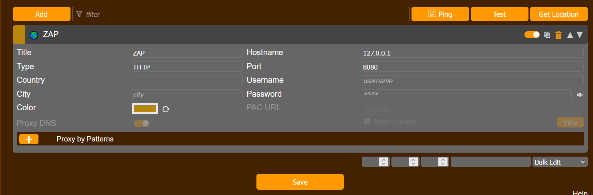

Lisäsin proxy by patterniin kaksi kohtaa: *://127.0.0.1/* ja *://portswigger.net/*. * tarkoittaa wildcard eli proxy ohjaa kaikki 127.0.0.1 ja portswigger.net osoitteet ZAPille. Kävin myös laittamassa varmuudeksi *://*.portswigger.net/* ja *://localhost/* että kaikki menevät varmasti proxille. *://*.portswigger.net/* koskee kaikkia portswiggerin alaverkkotunnuksia eli kaikkia portswigger.net/esimerkki/esim

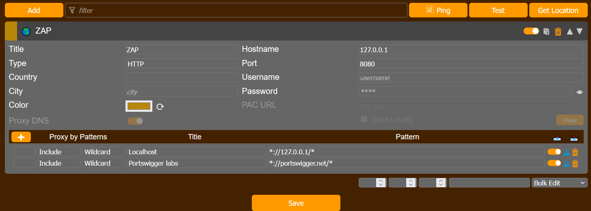

## PortSwigger Labs. Ratkaise tehtävät. Selitä ratkaisusi: mitä palvelimella tapahtuu, mitä eri osat tekevät, miten hyökkäys löytyi, mistä vika johtuu. Kannattaa käyttää ZAPia, vaikka malliratkaisut käyttävät harjoitusten tekijän maksullista ohjelmaa. Monet tehtävät voi ratkaista myös pelkällä selaimella. Malliratkaisun kopioiminen ZAP:n tai selaimeen ei ole vastaus tehtävään, vaan ratkaisu ja haavoittuvuuden etsiminen on selitettävä ja perusteltava.

## Cross Site Scripting (XSS)
  
  # c) Reflected XSS into HTML context with nothing encoded

Kyseessä on siis reflected XSS eli kuten selitin aikaisemmin kyseinen haavoittuvuus koskee nykyistä http-pyyntöä. Tässä labrassa pitää tehdä XSS-hyökkäys joka kutsuu alert functiota.

Menin takasin [portswiggerin sivulle](https://portswigger.net/web-security/cross-site-scripting) missä selitetään XSS. Sivulla selitetään yksinkertainen XSS, jossa URL:iin laitetaan . 

Kokeilin laittaa maalikohteen URL:in loppuun   

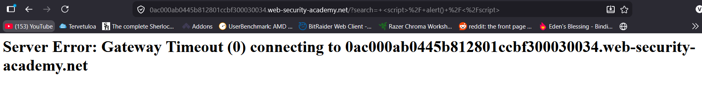

Se ei toiminut, mutta huomasin että se lisäsin erikoismerkkejä siihen joten korjasin sen oikeaan muotoon 

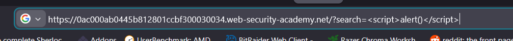

Sitten hain sen uudestaan hakupalkista

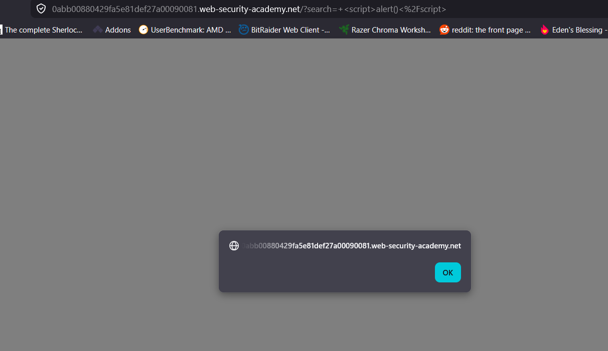

Sivulta tuli alert

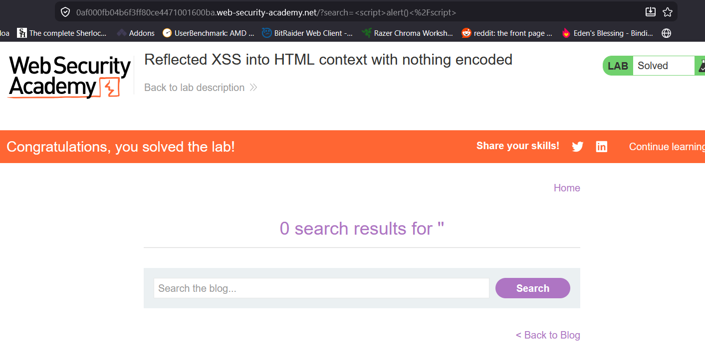

Ja onnistui tällä kertaa.

Mitä tässä tapahtui oli, että palvelin kohteli syöttöä   koodina eikä pelkästään tekstinä. Sivu ajoi koodia, koska syötettä ei kohdeltu pelkkänä tekstinä ja sen takia siihen tuli alert.

  # d) Stored XSS into HTML context with nothing encoded

Tässä labrassa on kyse stored XSS eli verkkosivun tietokanta. Tässä pitää kutsua alert functio kommenttina.

Labrassa siis sama metodi , mutta se jätetään kommenttina eikä laiteta hakupalkkiin.

Klikkasin ensimmäisestä postauksesta ja sen lopussa on kommenttikenttä. Täytin tarvittavat tiedot.

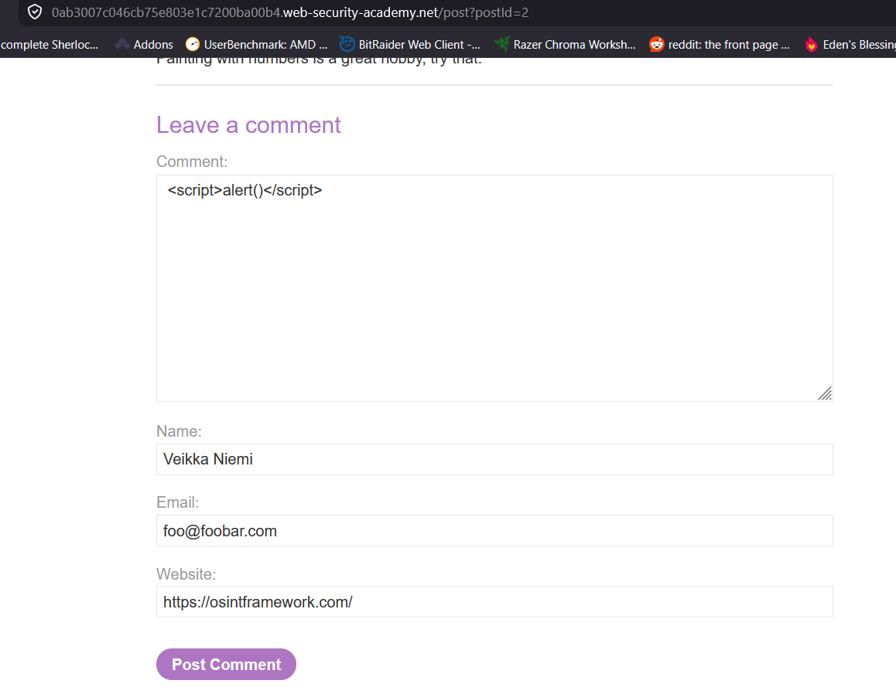

Tärkein näistä on tietyisti itse kommentti, muut ovat vain lisätietoja jota tarvitaan kommentin lähettämiseksi.

Lähetin kommentin.

Labra tuli ratkaistuksi ja kun painoin back to blog, javascript alert ilmestyi(joka oli kommentissani)

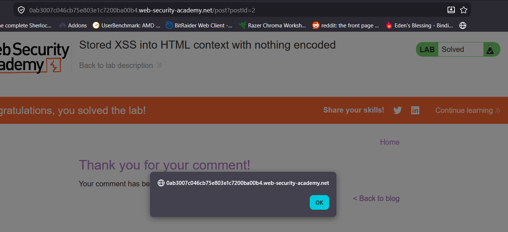

Nyt kun menin uudestaan postauksen sivulle ja latasin sivun uudestaan, sama alert tuli uudestaan

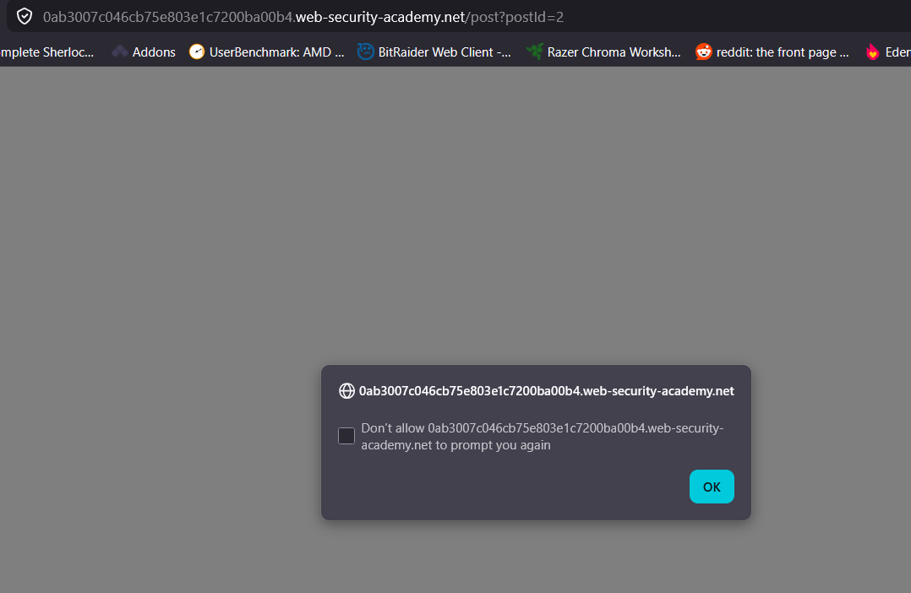

Tämän seurauksena nyt kun kuka tahansa muu käy kyseissä postauksessa heillekkin tulee tuo javascript alert. Se jää sinne ja tallentuu sivun tietokantaa kunnes se poistetaan. Bonuksena on se että se koodi pyörii sitten uhrin koneella eikä hyökkääjän koneella

  
  
  # e) Selitä esimerkin avulla, mitä hyökkääjä hyötyy XSS-hyökkäyksestä. Alert("Hei Tero!") ei vielä tarjoa kummoista pääsyä. (Tässä alakohdassa ei tarvitse tehdä testejä tietokoneella, pelkkä lyhyt ja selkeä selitys riittää.)

Esimerkiksi jos hyökkääjä saa tehtyä stored XSS jonnekkin, sinne voi alertin sijaan tehdä uskottavan (tai ei niin uskottavan) valheellisen lomakkeen jonne uhrin pitää syöttää uudelleen käyttäjänimen ja salasana koska esim. Istunto vanheni tai jotain sellaista. Lomakkeesta tunnukset menevät hyökkääjälle, josta hän voi itse mm. vaihtaa salasanan tai myydä tunnukset eteenpäin.
  
  ## Path traversal
  
  # f) File path traversal, simple case. Laita tarvittaessa Zapissa kuvien sieppaus päälle.

Labrassa pitää noutaa /etc/passwd sisältö, haavoittuvaisuus on tuotteiden kuvissa, jonka takia ZAPissa pitää laittaa kuvien sieppaus päälle

Avasin ZAPin ja klikkasin sivun tuotetta

Tämä oli näkymä ZAPissa

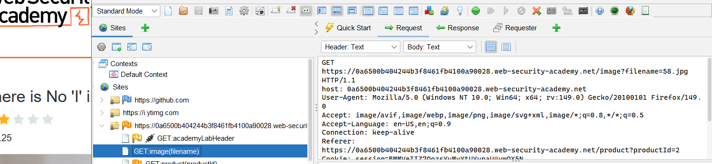

Siinä oli GET-pyyntö:

https://0a6500b404244b3f8461fb4100a90028.web-security-academy.net/image?filename=58.jpg

Labrassa halutaan /etc/passwd, joten koitin muokata sitä. Tunnilla Tero kertoi, että ctrl+w avaa requester tabin jolla voi muokata ja uudelleenlähettää pyyntöjä.

Muokkasin sitä https://0a6500b404244b3f8461fb4100a90028.web-security-academy.net/image?filename=/etc/passwd

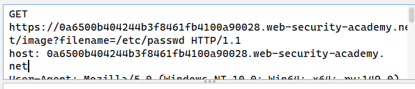

Se ei toiminut, tuli koodi 400 no such file 

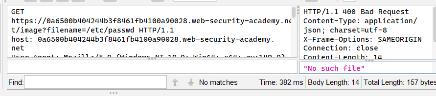

Pähkäilin asiaa hetken ja tajusin että tämähän on file treversal eli pitääkin varmaan navigoida tiedostoja hakemistoissa

Kävin lukemassa uudestaan portswiggerin sivun siitä https://portswigger.net/web-security/file-path-traversal

Siellä mainittiin että kuvat yleensä ei säilytetä root-kansiossa vaan esim /var/www/images

Se mitä yritin äsken tehdä oli mennä kansioon /var/www/images/etc/passwd , mutta sellaista ei ole olemassa palvelimella, jotenka tuli koodi 400 GET-pyynnöstä

GET-pyynnöllä pitää mennä hakemistossa taaksepäin, jotta pääsee /etc/passwd

Hakemistossa taaksepäin pääsee cd .. , joten se toimii myös tässäkin tapauksessa

Eli tässä pitää muuttaa pyyntöä 

.../image?filename=../../etc/passwd

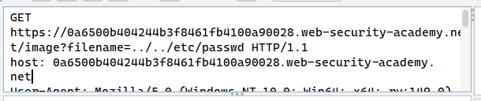

Tuli taas koodi 400, joten kokeilin lisätä yhden lisää eli 

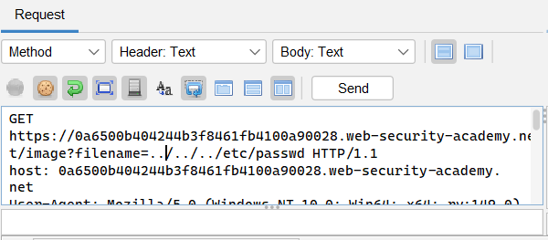

Tuli koodi 200 eli ok, ratkaisin labran, mutta en päässyt näkemään itse /etc/passwd sisältöä. Voi olla että se on kuvitteellinen tai en vain osannut löytää sitä ZAPista.

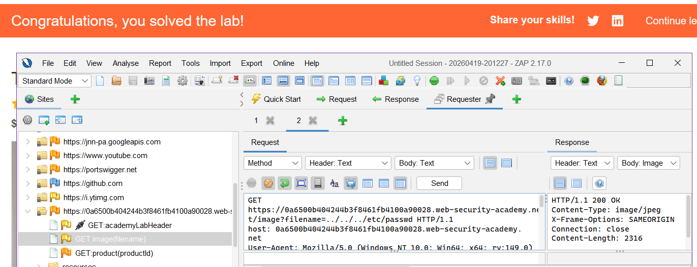

Haavoittuvuus johtuu siis siitä että sovellus ei validoi tiedostopolkua oikein, joten asiattomat pääsevät käsiksi sinne.

        
  # g) File path traversal, traversal sequences blocked with absolute path bypass

Tavoite on sama kuin äskeisessä saada /etc/passwd sisältö

Kokeilin samaa temppua eli muutin filename=../../../etc/passwd

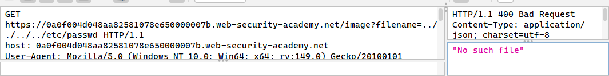

Se ei toiminut, 400 bad request

Kokeilin käyttää absoluuttista polkua (osittain koska se on ainoa toinen keino mitä tiedän ja koska tehtävän annossa on absolute path bypass) eli pelkästään filename=/etc/passwd

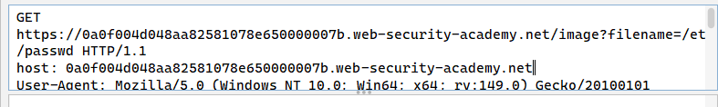

Se toimi, koodi 200

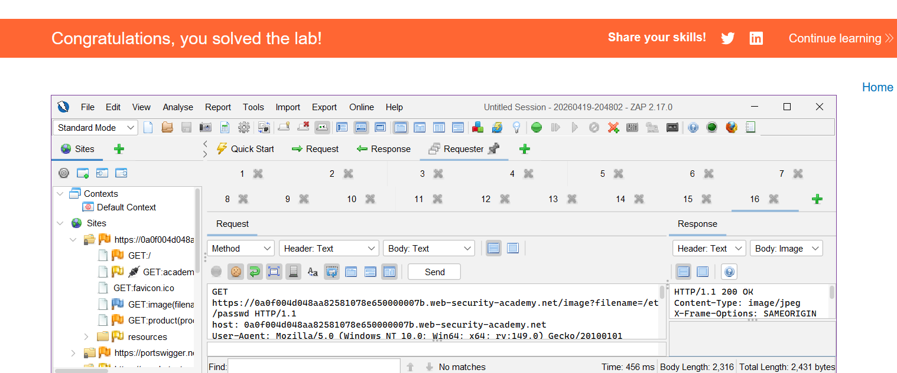

Sivu esti pelkästään traversalin, mutta ei absoluuttista polkua. Tämä pitää ottaa huomioon, kun suunnittelee sivua: molemmat keinot pitää estää.

  # h) File path traversal, traversal sequences stripped non-recursively

Kolmannessa on vieläkin sama homma, joten kokeilin aikaisempi tapoja. ../../../etc/passwd ja /etc/passwd

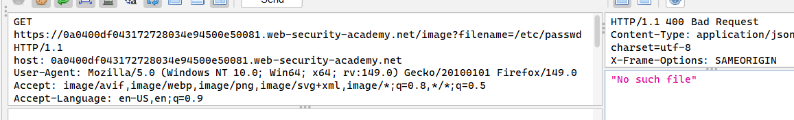

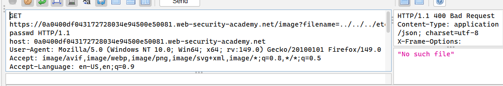

Kumpikaan keino ei toimi eli sivulla on puolustusta molemmille traversal keinoille. Labran nimi vihjaa, että palvelin poistaa merkkijonosta näitä traversal keinoja, minkä takia aikaisemmin käytetyt tavat eivät toimi. En oikeastaan tiennyt mitä tällä tiedolla voi tehdä joten jouduin katsomaan apua 

https://www.youtube.com/watch?v=_6ADm32rENs

Videossa ../../../etc/passwd lisätään ylimääräisiä . ja / merkkejä. Lopullinen merkkijono on siis ....//....//....//etc/passwd

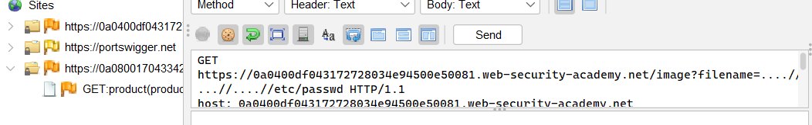

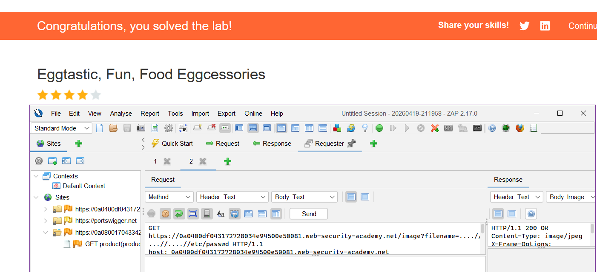

Ratkaisu käy järkeen näin jälkeen päin (tietysti). Palvelin poistaa merkit . ja / , mutta vain kerran joten se poistaa ylimääräiset, joka puolestaan jättää sopivasti ../../../etc/passwd. Ja näin pääsee käsiksi hakemistoon /etc/passwd

  ## Insecure Direct Object Reference (IDOR)
    
  # i) Insecure direct object references

Tässä pitää löytää käyttäjä carloksen salasana ja kirjautua siihen. Lisätietona tarjotaan että, chättilokit tallennetaan suoraan palvelimen tiedostojärjestelmään. Lisäksi lokit haetaan staattisilla URL:lla. 

Asioiden säilyttäminen staattisesti on vaarallista ja ovat haavoittuvaisia juuri esim. IDOR:lle. Niitähän voi suoraan selailla vaihtamalla numeroa URL:sta. 

Painoin live chat ja lähetin viestin.

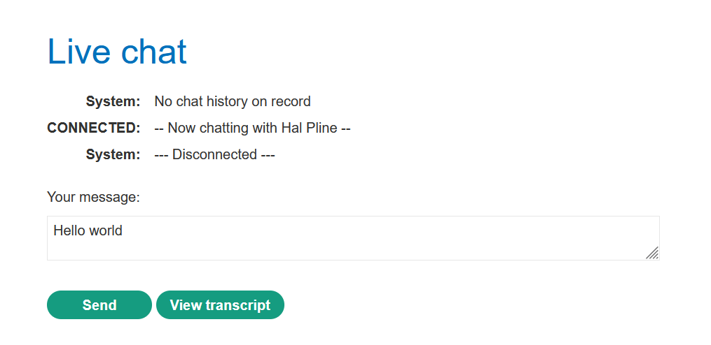

Painoin view transcript. Se latasin 2.txt. Tämä oli mielenkiintoista.

Laitoin ZAPin päälle.

Laitoin uuden viestin ja painoin taas view transcript. Se latasi 3.txt. Nämä tiedostot siis tallentuvat numerojärjestyksessä.

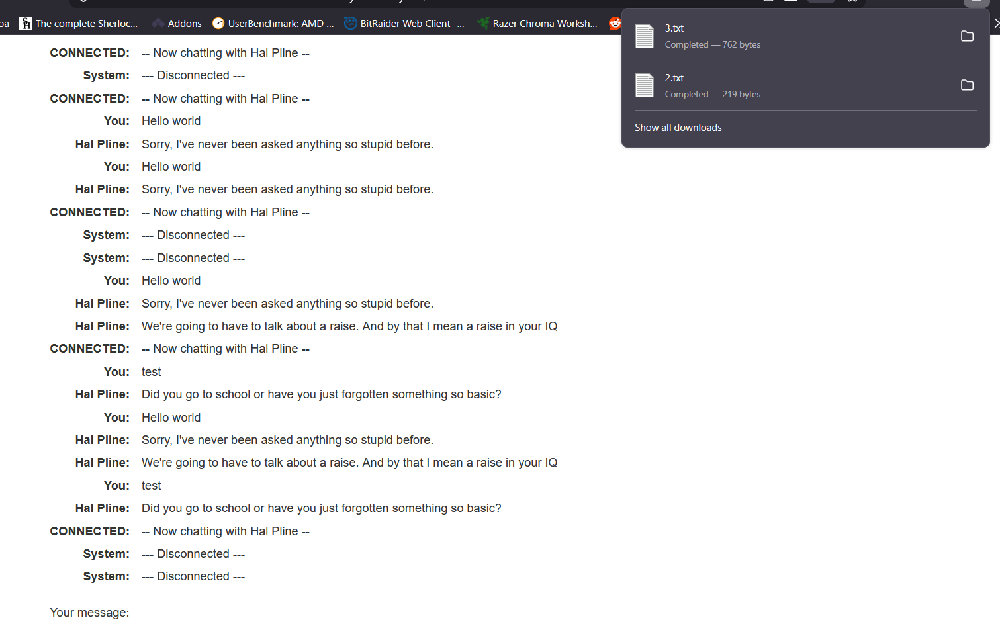

Mitäköhän on 1.txt sisällä?

ZAP otti GET 3.txt talteen. Kokeilin muokata sitä että saisin 1.txt

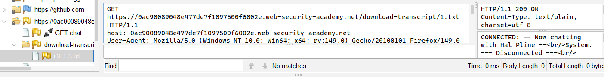

Lähetin sen. Tuli koodi 200 ok, lisäksi ZAP näytti koko 1.txt keskustelun:

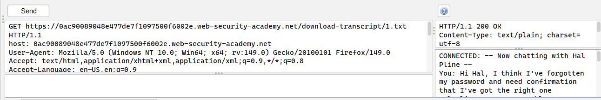

CONNECTED: -- Now chatting with Hal Pline --
You: Hi Hal, I think I've forgotten my password and need confirmation that I've got the right one
Hal Pline: Sure, no problem, you seem like a nice guy. Just tell me your password and I'll confirm whether it's correct or not.
You: Wow you're so nice, thanks. I've heard from other people that you can be a right ****
Hal Pline: Takes one to know one
You: Ok so my password is b2epczkpfgpshelnwqjh. Is that right?
Hal Pline: Yes it is!
You: Ok thanks, bye!
Hal Pline: Do one!

Eli käyttäjänimi on carlos ja salasana on b2epczkpfgpshelnwqjh

Menin my account, syötin käyttäjänimen ja salasanan ja pääsin sisään carloksen tilille.

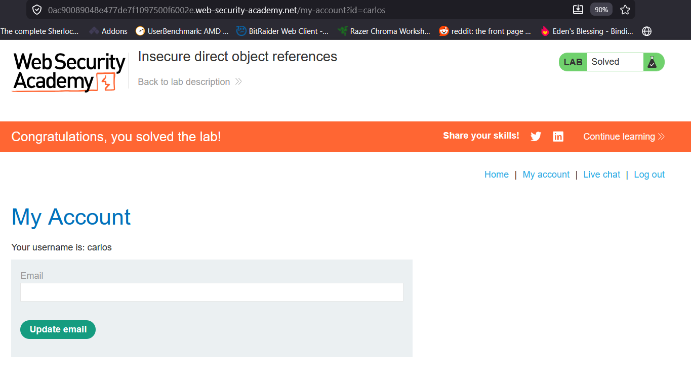

Haavoittuvuus johtuu siitä, että keskustelut tallennetaan numerojärjestyksessä sekä palvelin ei tarkista kunnolla kenellä on pääsy niihin keskusteluihin
  

  ## Lähteet

https://terokarvinen.com/tunkeutumistestaus

https://owasp.org/Top10/2021/A01_2021-Broken_Access_Control/index.html

https://portswigger.net/web-security/access-control/idor

https://portswigger.net/web-security/file-path-traversal

https://portswigger.net/web-security/cross-site-scripting

https://addons.mozilla.org/en-US/firefox/addon/foxyproxy-standard/?utm_source=addons.mozilla.org&utm_medium=referral&utm_content=search

https://www.youtube.com/watch?v=_6ADm32rENs
