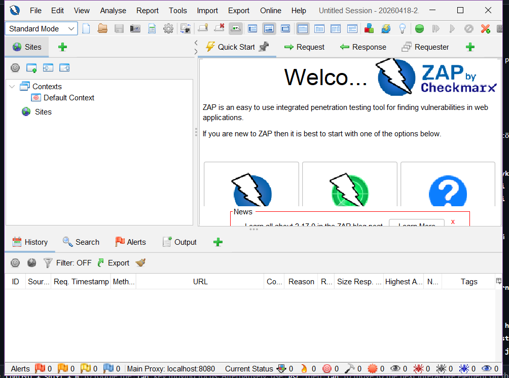
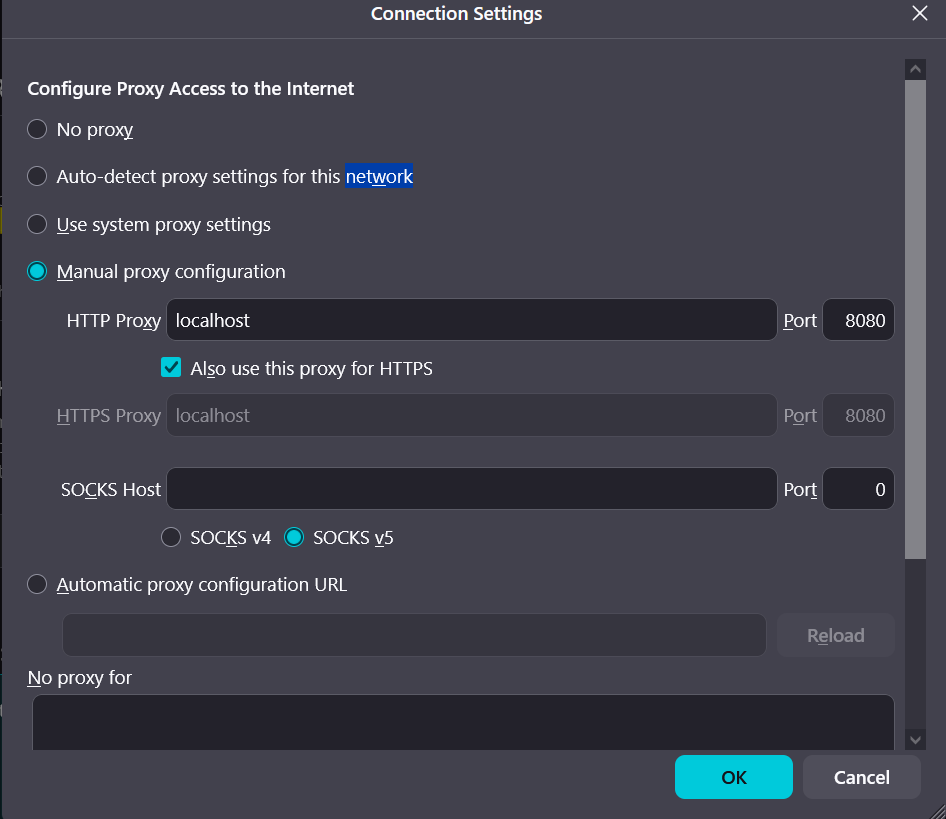
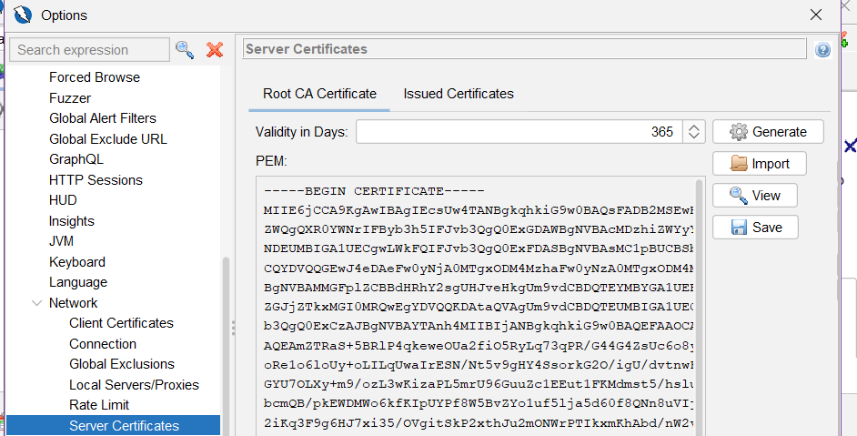
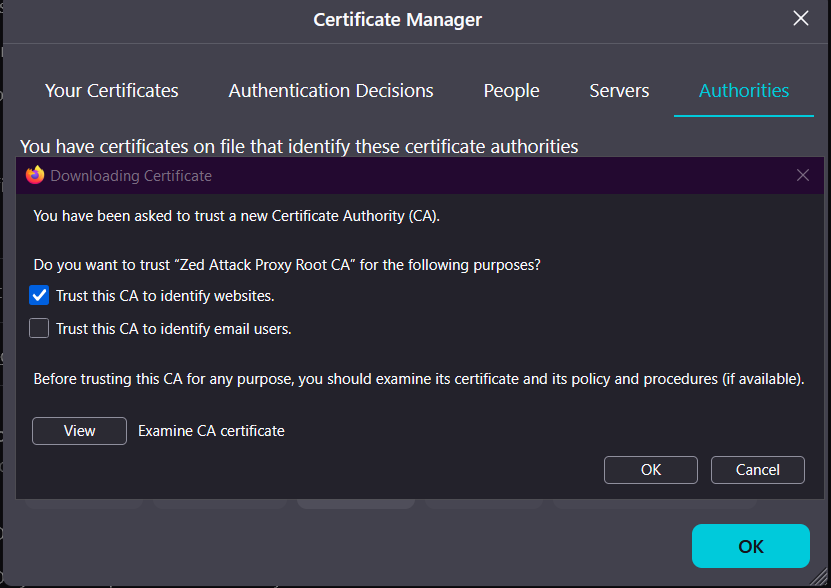
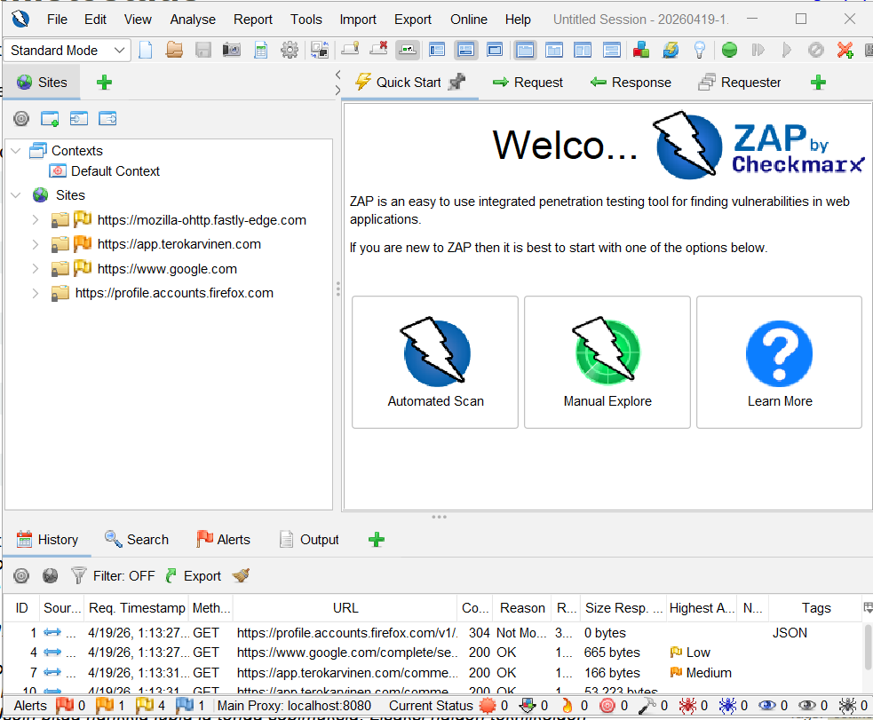

## x) Lue/katso ja tiivistä. (Tässä x-alakohdassa ei tarvitse tehdä testejä tietokoneella, vain lukeminen tai kuunteleminen ja tiivistelmä riittää. Tiivistämiseen riittää muutama ranskalainen viiva kustakin artikkelista - ei pitkiä esseitä. Kannattaa lisätä myös jokin oma ajatus, idea, huomio tai kysymys.)

# OWASP 2021: OWASP Top 10:2021
  
  A01:2021 – Broken Access Control (IDOR ja path traversal ovat osa tätä)

-  Pääsynhallinta määrittää millä käyttäjillä on oikeudet tehdä mitäkin, määritetyn pääsynhallinnan rikkominen tai sen puutteellisuus voi johtaa mm. datan muokkaamiseen tai tuhoamiseen asiattomilta
- Eli käytännössä käyttäjä/hyökkääjä tekee jotain mihin hänellä ei pitäisi olla oikeuksia tehdä
- Sen esiintymistä voi vähentää mm. antamalla käyttäjille vain ne oikeudet jota he tarvitsevat (ja tarkastamalla säännöllisesti että tämä pitää paikkansa)

## PortSwigger Academy:

  # Insecure direct object references (IDOR)

- IDOR on tilanne jossa mahdollista päästä käsiksi "objekteihin" käyttäjä syötön perusteella
- Esimerkki objektista on vaikka esimerkki.com/kayttaja100 , jos se on haavoittuvainen tälle niin kuka tahansa voi kirjoittaa esimerkki.com/101 ja päästä sinne profiiliin, koska palvelin ei tarkasta oikein kenellä on oikeus päästä mihinkin profiiliin

  
  # Path traversal

- Tässä haavoittuvuudessa hyökkääjä pääsee suoraan navigoimaan palvelimen hakemistoja, koska se suorittaa komentoja palvelimen komentorivillä
- Joten heikossa järjestelmästä voi hakea suoraan palvelimen tiedostoja hakupalkista

  
  # Cross-site scripting
- XSS haavoittuvuudessa hyökkääjä pystyy ajaa koodia käyttäjä selaimessa
- Niitä on kolme eri alakategoriaa, jotka kuvaavat mistä hyökkääjän koodi ajataan: reflected xss(nykyinen http-pyyntö), Stored (verkkosivun tietokanta) ja DOM-based (haavoittuvuus on asiakaspuolen koodissa eikä palvelinpuolen koodissa)

## a) Totally Legit Sertificate. Asenna OWASP ZAP, generoi CA-sertifikaatti ja asenna se selaimeesi. Laita ZAP proxyksi selaimeesi. Laita ZAP sieppaamaan myös kuvat, niitä tarvitaan tämän kerran kotitehtävissä. Osoita, että hakupyynnöt ilmestyvät ZAP:n käyttöliittymään. (Voi vaatia Firefox about:config network.proxy.allow_hijacking_localhost. Foxyproxy laittoi tämän aiemmin päälle itse. Kalin Firefox ESR oli viimeksi ongelmia Foxyproxyn kanssa - vaihtoehtona on asettaa Proxy käsin Settings, hakusana "proxy")

Latasin ZAPin täältä sivulta https://www.zaproxy.org/ (päätin kokeilla windowsilla, saa nähdä jos jään katumaan tätä päätöstä myöhemmin)

Avasin ZAPin ja se avautui normaalisti.

Laitoin nämä asetukset firefoxin network-asetuksista 

Manual proxy configuration: localhost 8080 ja port 8080 (ZAP pyörii oletuksena localhostissa portissa 8080)

Seuraavaksi generoin CA-sertifikaatin. Menin tools -> options -> network -> server certificates. Painoin save, jotta se tallentuu koneelleni.

Sitten menin Firefoxin asetuksiin: settings -> Privacy and security -> Certificates -> Manage sertificates ja Authorities välilehti

Laitoin trust this CA to identify websites ja ok 

Ja kun menin esimerkiksi terokarvinen.com sivulle niin se näkyy ZAPissa

Kävin myös laittamassa kuvan sieppauksen päälle: Tools -> Options -> Display -> Process images in HTTP responses/requests

## b) Kettumaista. Asenna "FoxyProxy Standard" Firefox Addon, ja lisää ZAP proxyksi siihen. Käytä FoxyProxyn "Patterns" -toimintoa, niin että vain valitsemasi weppisivut ohjataan Proxyyn. (Läksyssä ohjataan varmaankin PortSwigger Labs ja localhost.)

## PortSwigger Labs. Ratkaise tehtävät. Selitä ratkaisusi: mitä palvelimella tapahtuu, mitä eri osat tekevät, miten hyökkäys löytyi, mistä vika johtuu. Kannattaa käyttää ZAPia, vaikka malliratkaisut käyttävät harjoitusten tekijän maksullista ohjelmaa. Monet tehtävät voi ratkaista myös pelkällä selaimella. Malliratkaisun kopioiminen ZAP:n tai selaimeen ei ole vastaus tehtävään, vaan ratkaisu ja haavoittuvuuden etsiminen on selitettävä ja perusteltava.

# Cross Site Scripting (XSS)
  
  c) Reflected XSS into HTML context with nothing encoded
        
  d) Stored XSS into HTML context with nothing encoded
  
  e) Selitä esimerkin avulla, mitä hyökkääjä hyötyy XSS-hyökkäyksestä. Alert("Hei Tero!") ei vielä tarjoa kummoista pääsyä. (Tässä alakohdassa ei tarvitse tehdä testejä tietokoneella, pelkkä lyhyt ja selkeä selitys riittää.)
  
  # Path traversal
  
  f) File path traversal, simple case. Laita tarvittaessa Zapissa kuvien sieppaus päälle.
        
  g) File path traversal, traversal sequences blocked with absolute path bypass
        
  h) File path traversal, traversal sequences stripped non-recursively
        
  # Insecure Direct Object Reference (IDOR)
    
  i) Insecure direct object references

  ## Lähteet

https://terokarvinen.com/tunkeutumistestaus

https://owasp.org/Top10/2021/A01_2021-Broken_Access_Control/index.html

https://portswigger.net/web-security/access-control/idor

https://portswigger.net/web-security/file-path-traversal

https://portswigger.net/web-security/cross-site-scripting
