## x) Lue/katso/kuuntele ja tiivistä. (Tässä x-alakohdassa ei tarvitse tehdä testejä tietokoneella, vain lukeminen tai kuunteleminen ja tiivistelmä riittää. Tiivistämiseen riittää muutama ranskalainen viiva. Lisää mukaan jokin oma idea, huomio, kysymys tai kommentti.)
 
# Karvinen 2023: Find Hidden Web Directories - Fuzz URLs with ffuf

- FFufilla voi testata löytää tuhansia piilossa olevia hakemistoja nopeasti, paljon nopeammin kuin manuaalisesti käsin
- Lisäksi artikkelissa käytiin läpi asennus, syntaksi ja demo työkalun toiminnasta
- Ffufissa tärkeää on sanakirja jota työkalu käy läpi. Yleisimpiä on mm. https://github.com/danielmiessler/SecLists , mutta sen voi (ja kannattaa) vaihtaa kohteen perusteella
  
  # Jompi kumpi, Hoikkalan video tai teksti: Hoikkala 2023: ffuf README.md

  - Repossa on asennusohjeet, lista komennoista ja parametreista sekä esimerkkivideoita
  - Tärkeimmät ovat mm.

  -u: URL eli mikä on kohdesivu
  
  -w: Spesifioi mikä sanalista käytössä (yleensä seclist)
  
  -mc: match statuscodes, näyttää vain valitut koodit
  
  -fc: filter status codes, filtteröi pois status koodit
  
  -v: näyttää yksityiskohtaisemmin mitä ffuf tekee
          
            
## a) Fuzzzz. Ratkaise dirfuz-1 artikkelista Karvinen 2023: Find Hidden Web Directories - Fuzz URLs with ffuf.

Kalissa on jo asennettu ffuf 

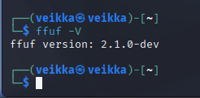

Laitoin pystyyn ympäristön dirfuz-1 niin kuin artikkelissa pistettiin dirfuz-0 (eli lataaminen wget:llä, lupien anto chmodilla ja itse ajaminen ./dirfuzt-1)

    wget https://terokarvinen.com/2023/fuzz-urls-find-hidden-directories/dirfuzt-1
    chmod u+x dirfuzt-1
    ./dirfuzt-1
    

 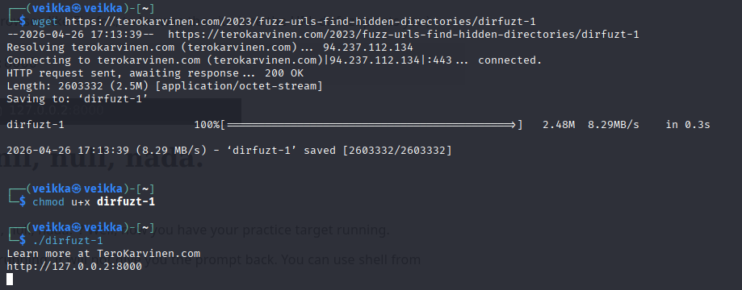

Menin tarkistamaan, että se oikeasti on pystyssä osoitteessa http://127.0.0.2:8000

 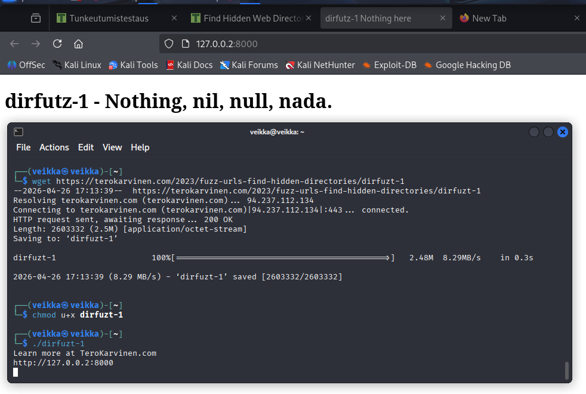

Latasin myös Teron ohjeen mukaan seclistin sanakirjan 

    wget https://raw.githubusercontent.com/danielmiessler/SecLists/master/Discovery/Web-Content/common.txt

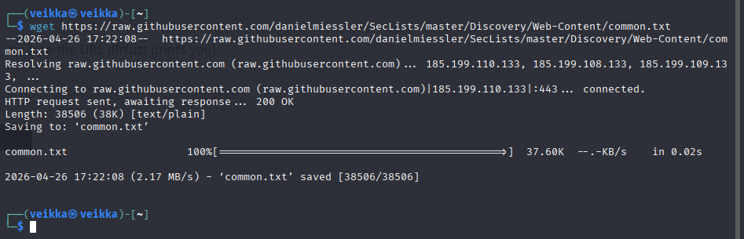

Laitoin vielä varmuudeksi netin pois opetetulla tavalla, ettei käy mitään vahinkoja

 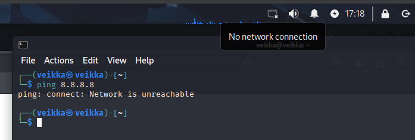

Ympäristö on pystyssä eli voi lähteä ffuffailemaan

Kokeilin artikkelissa olevaa komentoa ensiksi eli 

    ffuf -w common.txt -u http://127.0.0.2:8000/FUZZ

 
 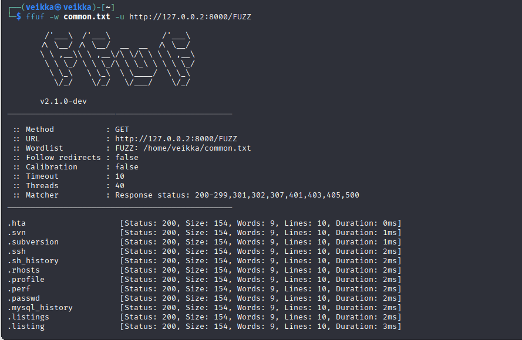

 Tuli erittäin paljon tuloksia

 Selitys komennosta

ffuf: käynnistää ohjelman

-w: sanakirja tiedostopolku

common.txt: käytetty sanakirja

-u: spesifioi kohteen osoittten(URL)

http://127.0.0.2:8000/FUZZ: 

127.0.0.2: local host, paikallinen kone

8000: portti

/FUZZ: ffuf korvaa sanan FUZZ esim. http://127.0.0.2:8000/abc, http://127.0.0.2:8000/abcd. Kun käytössä on sanakirja niin se korvaan sen mukaan esim. http://127.0.0.2:8000/admin, http://127.0.0.2:8000/admin1 jne.

Sitten takasin tuloksiin. Niitä on tosi paljon joten niitä kannatta filtteröidä jotenkin. Niiden status näyttää olevan sama(200), joten lähdin suodattamaan siitä.

     ffuf -w common.txt -u http://127.0.0.2:8000/FUZZ -fc 200

 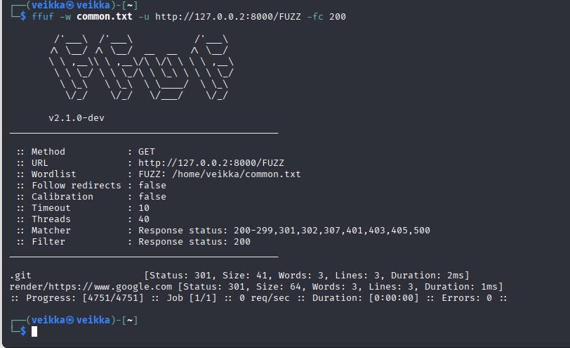

 Tuli vain yksi jonka koodi ei ole 200, .git. Menin katsomaan
 
 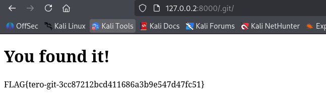

 Löysin yhden lipun, mutta piti löytää kaksi: Admin sivu ja versionhallinta sivu

 Ffuf näyttää eri kategorioita tuloksista. Status oli ensimmäinen, josta aloitin. Siirryin yhden oikealle eli statuksesta kokoon (size). Ffuffin readme.md-tiedosto kertoo, että kokoa voi suodattaa flägillä -fs. Kokeilin sitä seuraavaksi. Pikaselauksella yleisin koko on 154. Ajoin komennon mutta vaihdoin -fc 200 -fs 154

    ffuf -w common.txt -u http://127.0.0.2:8000/FUZZ -fs 154
 

 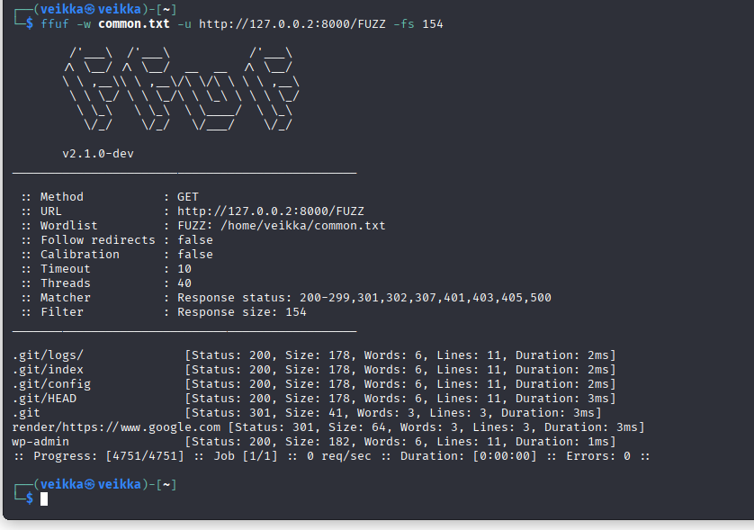

 Siinä tuli enemmän tuloksia. Äsken löytämäni .git ja sen alahakemistot sekä wp-admin. Toinen lippu mikä piti löytää oli admin sivu joten menin katsomaan  http://127.0.0.2:8000/wp-admin

  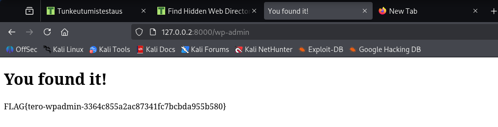

  Sieltä löytyi lippu ja viimein tuli ratkaistua tehtävä.

 

## b) Fuff me. Asenna FuffMe-harjoitusmaali. Karvinen 2023: Fuffme - Install Web Fuzzing Target on Debian
Ratkaise ffufme harjoitukset - kaikki paitsi ei "Content Discovery - Pipes".

Laitoin netin takaisin ja aloin asentamaan maaliympäristöä artikkelin mukaisesti.

    sudo apt-get install docker.io git ffuf
    git clone https://github.com/adamtlangley/ffufme
    
    cd ffufme/
    sudo docker build -t ffufme .
    sudo docker run -d -p 80:80 ffufme

Artikkelin ohjeet toimivat sujuvasti ja yllä olevien komentojen ajamisen jälkeen ffuf.me pyörii localhostilla näin

  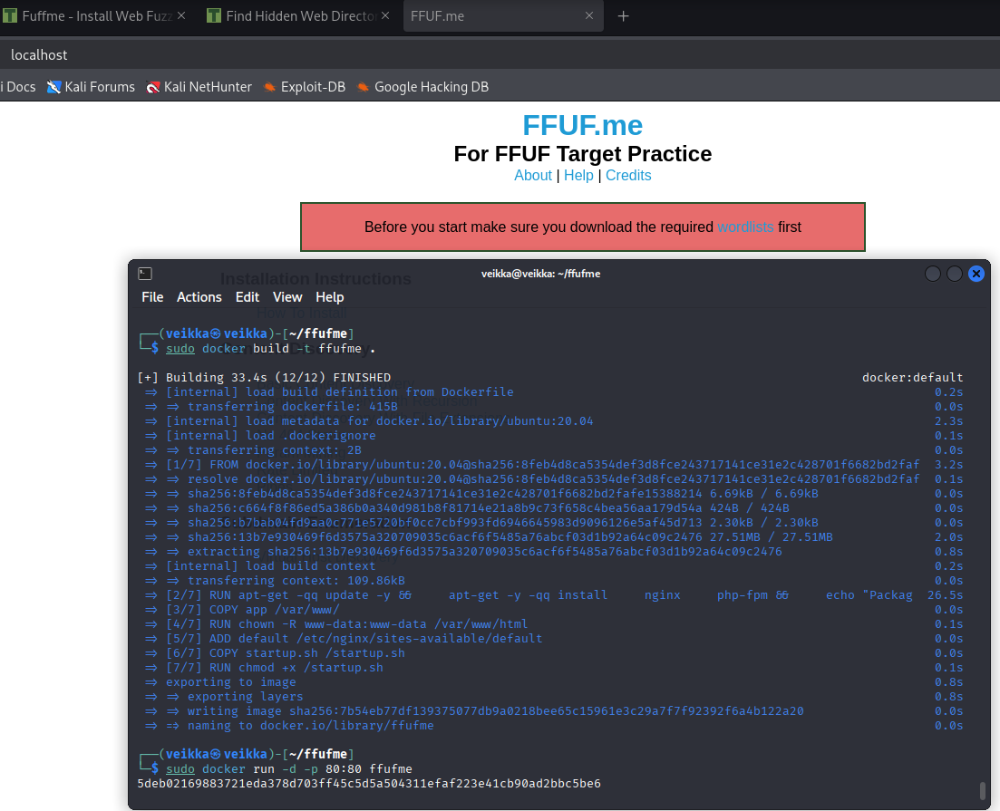

Latasin vielä tarvittavat sanalistat

    mkdir $HOME/wordlists
    cd $HOME/wordlists
    wget http://ffuf.me/wordlist/common.txt
    wget http://ffuf.me/wordlist/parameters.txt 
    wget http://ffuf.me/wordlist/subdomains.txt

 

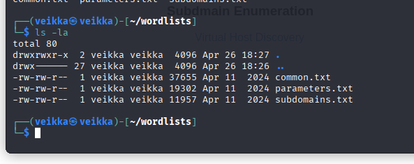
    

## c) Basic Content Discovery

Laitoin netin taas netin pois päältä ja aloin tekemään. Ensimmäinen näyttää olevan perus ffufaus, pitäisi löytyä class ja developement.log komennolla 

      ffuf -w ~/wordlists/common.txt -u http://localhost/cd/basic/FUZZ

  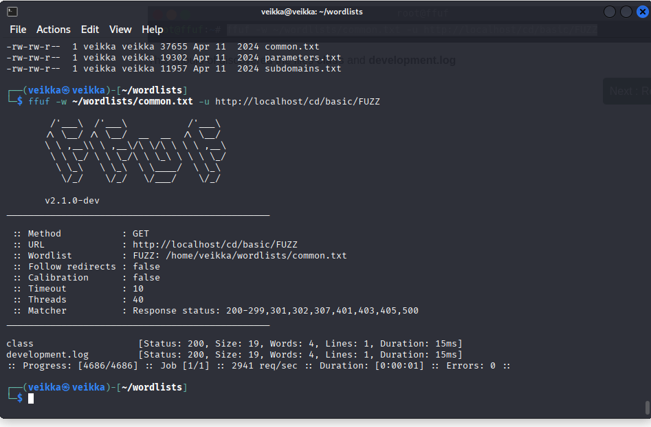

Sieltähän löytyi class ja developement.log

  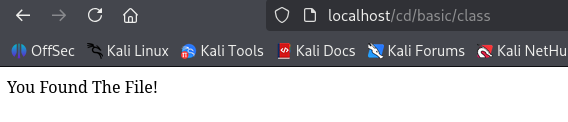

  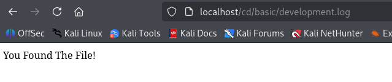
  

## d) Content Discovery With Recursion

Tässä ffuf kävi läpi kaikki hakemistot kunnes niitä ei ole enää jäljellä

 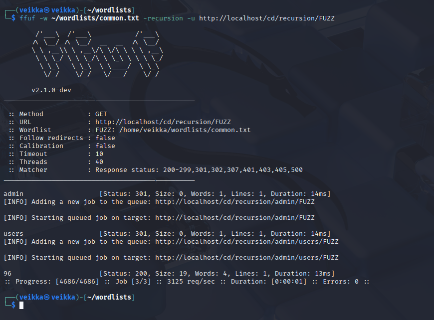

 Ffuf kävi ensin cd/recursion/admin, löysi hakemiston cd/recursion/admin/users -> cd/recursion/admin/users/96 lopetti tähän, koska ei löytänyt enää hakemistoja

 Kävin katsomassa, tässä vaihessa muistin että cURL on olemassa, sillä voi katsoa sivuja terminaalissa.

 Ffuffin löytämä koko polku siis on  localhost/cd/recursion/admin/users/96, josta löytyi lippu

  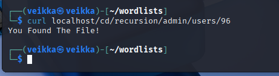

  

 
  

## e) Content Discovery With File Extensions

Tehtävässä pitää tiedostoa, jolla on tietty tiedostopääte: .log. Kuten aikaisemminkin ooli jo tehty Ffufissa pystyy suodattamaan löydettyjä tuloksia. 

-e parametri suodattaa tuloksia tiedostotyypin mukaan, tehtävässä haeteen .log tiedostoja joten lisäsin -e .log komentoon

    ffuf -w ~/wordlists/common.txt -e .log -u http://localhost/cd/ext/logs/FUZZ

 Sieltä löytyi yksi ainut .log tiedosto.

 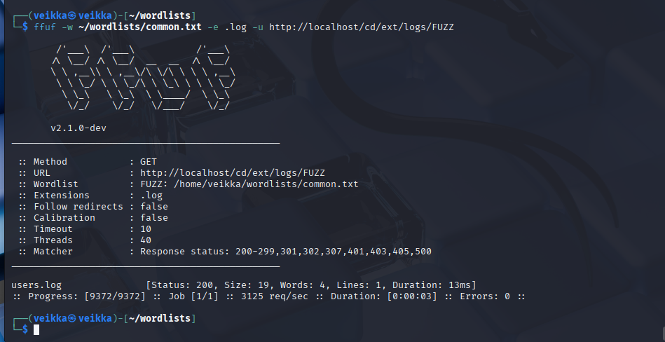

Sen sisältö oli mitä tehtäväss etsittiin.

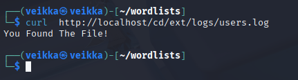

 

## f) No 404 Status

Tämä tehtävä oli aika samanlainen kuin a) dir-fuz1. Ffuf tulosti paljon sisältöä, koska sivut eivät osaa antaa oikeata virhekoodia 404 sivua ei löytynyt.

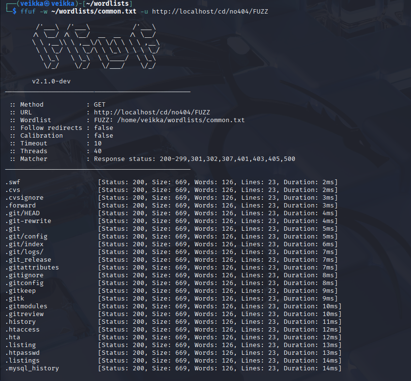

Se saakin ratkaistua samalla tavalla kuin dir-fuz1 eli suodattamalla yleisimmän tiedostokoon(669) pois parametrilla -fs 669

    ffuf -w ~/wordlists/common.txt -e .log -u http://localhost/cd/no404/FUZZ -fs 669

    

Löytyi yksi tiedosto, joka ei ole kokoa 669, secret

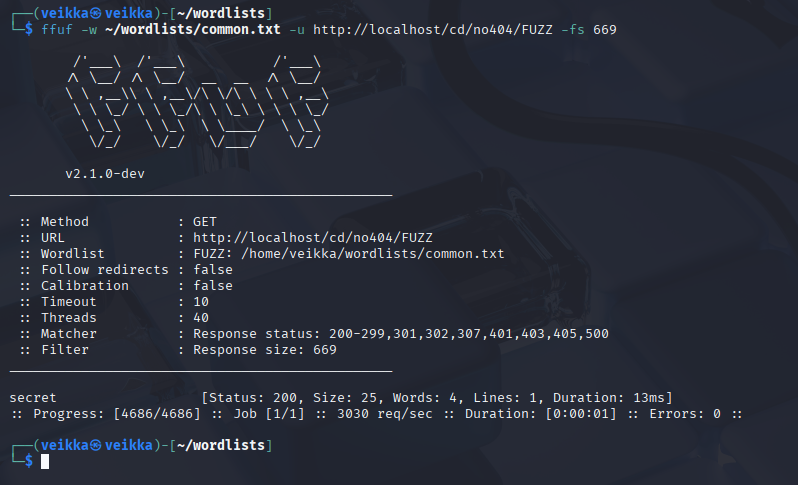

Sen sisällä ei ollut You found the file!, mutta se kuitenkin oli tiedosto jota pyydettiin etsimään

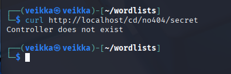

 
   

## g) Param Mining

Tehtävän sivu valittaa, että "required parameter missing". En oikeastaan ymmärtänyt, mitä tuo tarkoitti. Ffufilla voi kokeilla eri parametrejä. Ajoin tehtävässä annetun ffuffauksen

    
    ffuf -w ~/wordlists/parameters.txt -u http://localhost/cd/param/data?FUZZ=1

   

Se löysi yhden sopivan parametrin: debug

   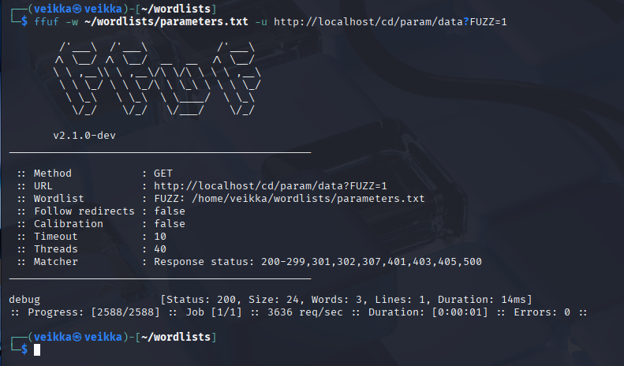

Nyt ymmärrän: Se koittaa etsiä piilossa olevia parametrejä jota se voi laittaa päälle. Koodauksessa 1 on yleensä true ja 0 false. Äsken tehty ffuffaus löysi että sivulla voi laittaa debugaus moodin = 1(true) eli päälle. 

Tarkistin curlilla

    curl http://localhost/cd/param/data?debug=1

   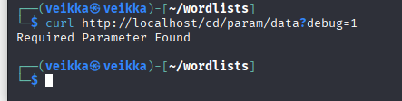 

Required parameter found eli "oikeassa tilantessa" debug moodi menisi päälle. Uhkatoimijat voivat hyödyntää debugia esim. auttamaan ymmärtää paremmin miten sisäinen järjestelmä toimii tai siellä voi olla käyttäjänimiä, salasanoja apiavaimia yms.
   

## h) Rate Limited

Ffuf toimi lähettämällä massiivisesti pyyntöjä palvelimelle. Useimmiten pyyntöjä rajotetaan per asiakas, että palvelu ei hidastuisi turhaan tai jumittuisi.

Tehtävässä rajoitetaan pyyntöjen määrää, kuten tässä demottu

  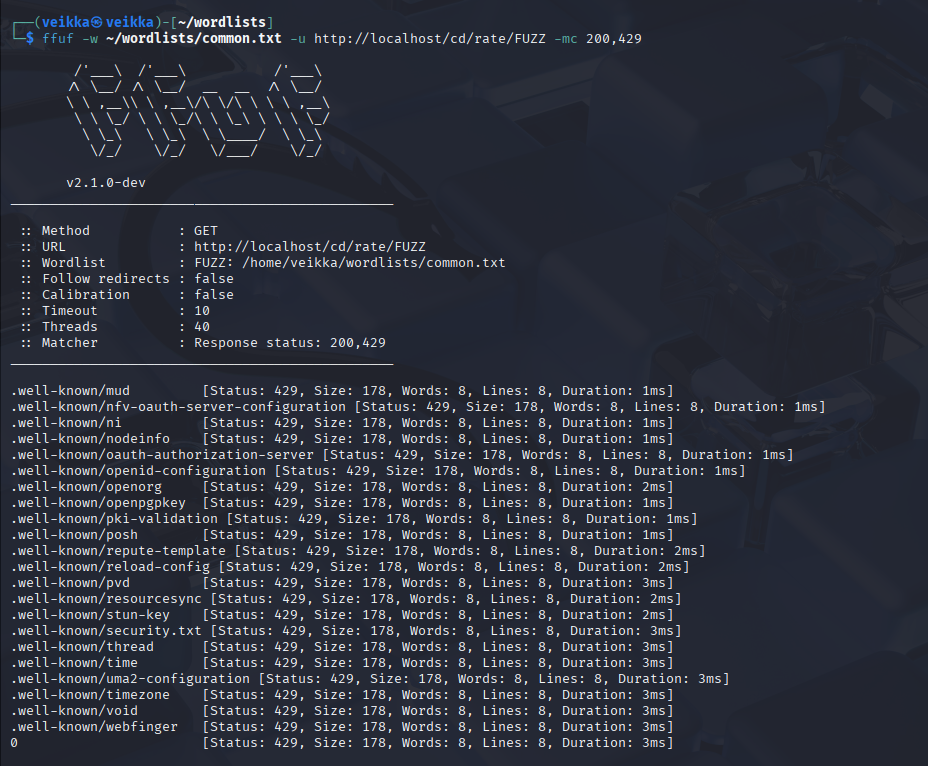 

Lista jatkuu ja jatkuu, täynnä koodia 429 Too many requests

Pyyntöjen määrää pitää siis keinotekoisesti hidastaa, että ei tule liikaa ruuhkaa

    ffuf -w ~/wordlists/common.txt -t 5 -p 0.1 -u http://localhost/cd/rate/FUZZ -mc 200,429

-t 5: enintään 50 pyyntöä sekunnissa

-p 0.1: pitää 0.1 sekunnin tauon joka pyynnön jälkeen

  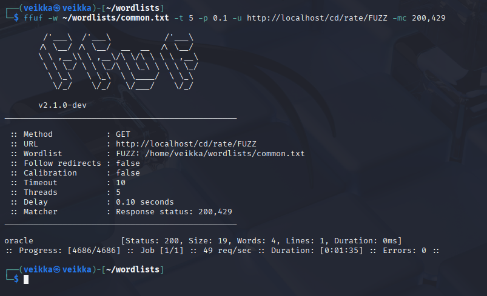 

Ffuffin ajo oli huomattavasti pidempi, mutta se on juuri mitä tässä tarvitaan että sivu ei estä pyyntöjä niiden liiallisuuden takia.

Sieltä löytyi haluttu oracle

 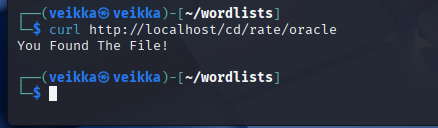 

## i) Subdomains - Virtual Host Enumeration

Viimeisessä tehtävässä ffufilla etsittiin aliverkkotunnuksia. 

         ffuf -w ~/wordlists/subdomains.txt -H "Host: FUZZ.ffuf.me" -u http://localhost

Ffuf siis korvaa sanan FUZZ aliverkkotunnuksesta esim FUZZ.ffuf.me -> admin.ffuf.me, admin123.ffuf.me jne.

Jälleen tuli massiivisesti koodia 200, koska kuten aikaisemmin mainittu, sivut eivät osaa antaa oikeaa koodia

 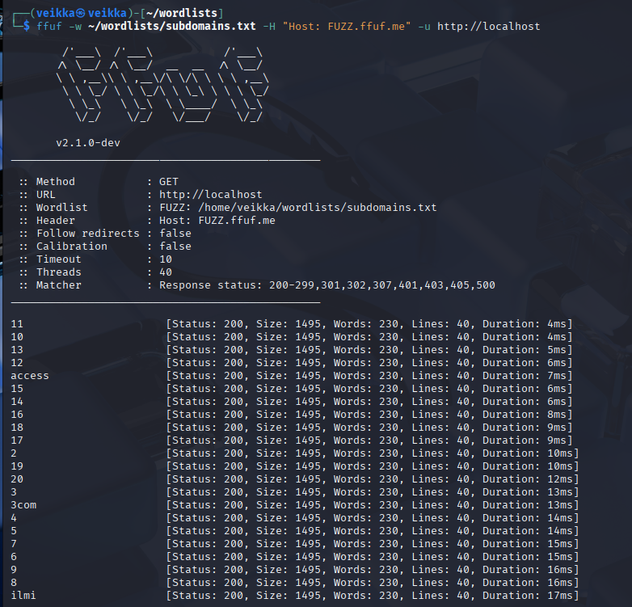 

Tietoa siis kannattaa suodattaa pois yleisimmän tekijän mukaan eli koon mukaan. Yleisin on 1495, joten suodatin sen pois. 

    ffuf -w ~/wordlists/subdomains.txt -H "Host: FUZZ.ffuf.me" -u http://localhost -fs 1495

Jäljelle jää redhat, jota piti etsiä.

 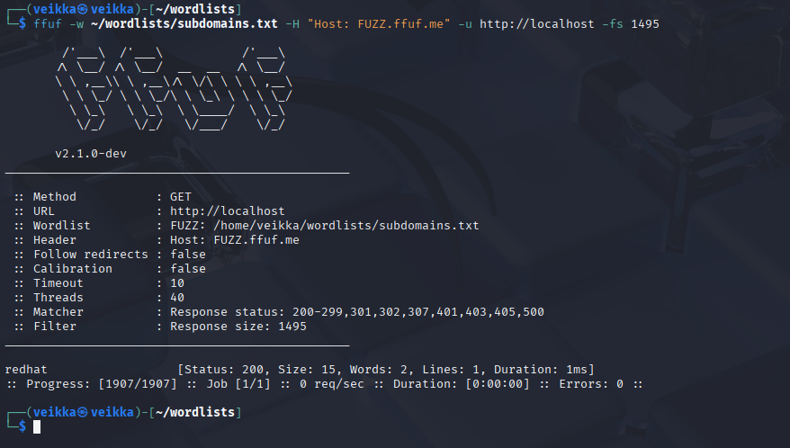 

 

## Lähteet

https://terokarvinen.com/tunkeutumistestaus

https://terokarvinen.com/2023/fuzz-urls-find-hidden-directories/

https://github.com/ffuf/ffuf/blob/master/README.md

https://terokarvinen.com/2023/fuzz-urls-find-hidden-directories/

https://terokarvinen.com/2023/fuffme-web-fuzzing-target-debian

