 ## x) Lue/katso ja tiivistä. (Tässä x-alakohdassa ei tarvitse tehdä testejä tietokoneella, vain lukeminen tai kuunteleminen ja tiivistelmä riittää. Tiivistämiseen riittää muutama ranskalainen viiva kustakin artikkelista. Kannattaa lisätä myös jokin oma ajatus, idea, huomio tai kysymys.)

 ##  Karvinen 2022: Cracking Passwords with Hashcat

- Hashcatilla voi korkata tiivisteitä antamalla sille sanakirjan sanoja, josta se luo tiivisteen. Jos sanankirjan tiiviste ja annettu tiiviste täsmään niin silloin se on korkattu
- Hashcatillä voi tunnistaan tiivisteen tyypin, Hashcatin pitää tietää tiivistetyypin korkkauksen aloittamiseen
- Hashcatin kometoihin pitää syöttää tiivistetyyppi, itse tiiviste ja myös voi laittaa mihin se tallennetaan -o <tiedostonimi>, jotta pääsee ajamaan hashcattia

 
 ##  Karvinen 2023: Crack File Password With John

- Artikkelissa käydään läpi miten John asennetaan, Kalissa se on valmiina
 - Siinä käydään myös miten salasanalla suojattu zip tiedosto korkataan, john tukee myös monen monta tiedostomuotoa
- Hashcatin ja John artikkelia perusteella John pystyy tunnistamaan automaattisesti asioita paremmin kuin hashcat, mutta Johnilla voi tietenkin spesifioida myös tarkemmin esim tiivistetyypin.
  
## a) Asenna Hashcat ja testaa sen toiminta murtamalla esimerkkisalasana.

Kalissa on asennettu Hashcat valmiina

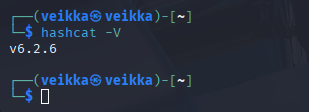

Sen voi asentaa komennolla

      sudo apt install hashcat

Seurasin artikkelin vaiheita, koska kyseessä on vasta testiajo

      mkdir hashcat
      cd hashcat

    wget https://github.com/danielmiessler/SecLists/raw/master/Passwords/Leaked-Databases/rockyou.txt.tar.gz
    tar xf rockyou.txt.tar.gz
    rm rockyou.txt.tar.gz
    

Pääsin tähän vaiheeseen

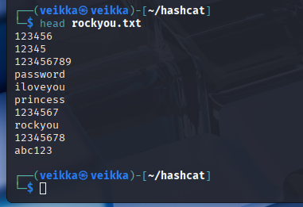

Sitten työskentelemään. Ensiksi tiivisteen tunnistus 

      hashid -m 6b1628b016dff46e6fa35684be6acc96

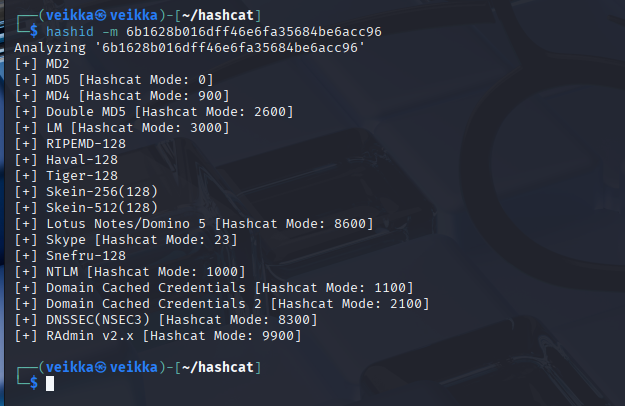

Artikkelissa mainittiin, että yleensä oikea on top 3 joukossa, tässä tiesin että se on MD5

Sitten itse korkkaaminen.

      hashcat -m 0 '6b1628b016dff46e6fa35684be6acc96' rockyou.txt -o solved

-hashcat: ohjelman valitseminen ja käynnistys

-m 0: hashcatin moodin valitseminen, hashid näyttää esim. kuvass yläpuolella MD5 mode 0, MD4 mode 900

-6b1628b016dff46e6fa35684be6acc96: Itse tiiviste

-rockyou.txt: Käytetty sanakirja

-o solved: mihin korkattu tiiviste tallennetaan

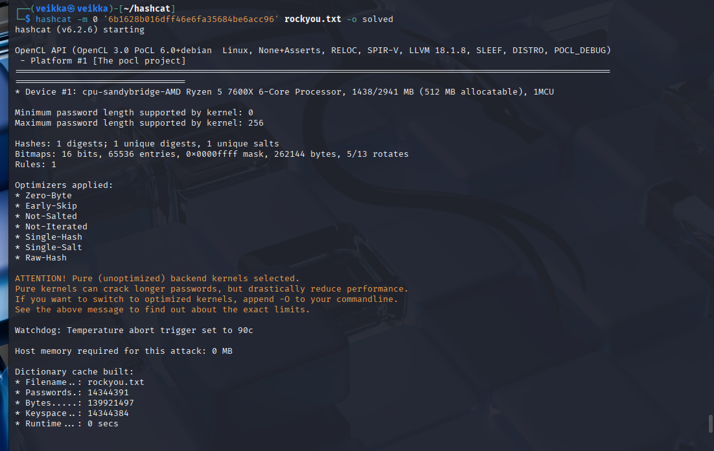

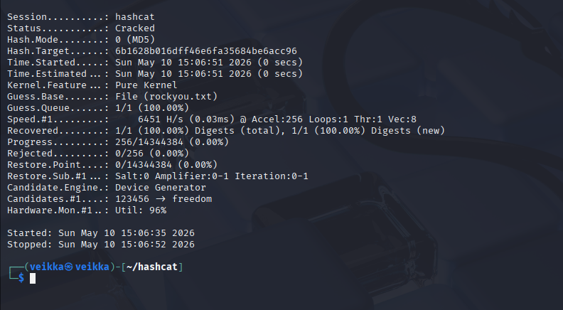

Kurkkaus solved tiedostoon

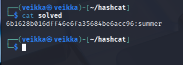

Ja siellähän se on salasana on summer

## b) Asenna John the Ripper ja testaa sen toiminta murtamalla jonkin esimerkkitiedoston salasana.

Kalissa on myös asennettu John valmiiksi

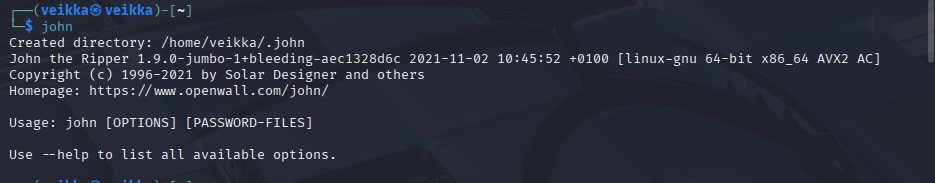

Latasin esimerkki ziptiedoston

    wget https://TeroKarvinen.com/2023/crack-file-password-with-john/tero.zip

 Se on salasanalla suojattu, mutta onneksi John the ripperillä voi korkata suojattu ziptiedostoja

John ei pysty suoraan korkkaamaan zip-tiedostoja vaan siitä pitää ensin ottaa tiiviste

 Löysin googlesta tämä artikkelin https://medium.com/@offensotvmrd/zip-password-cracking-using-john-the-ripper-3c1063c204d9

Siinä oli näin

    zip2john your_file.zip > hash.txt

Tero ohjeessa oli 

    $HOME/john/run/zip2john tero.zip >tero.zip.hash

Teron tapa oli varmempi, mutta kokeilin ensiksi Mediumin artikkelin mukaisesti koska se oli simppelimpi

    zip2john tero.zip > tero.zip.hash

 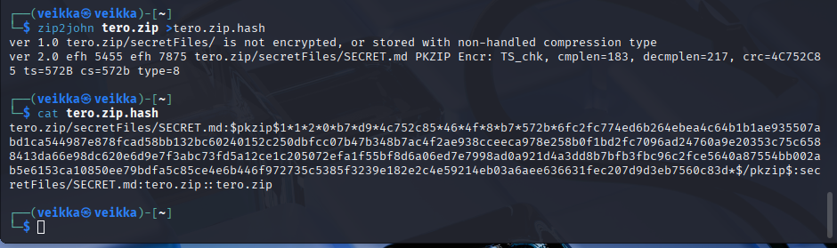

 
Sen jälkeen tiivisteen voi antaa Johnille

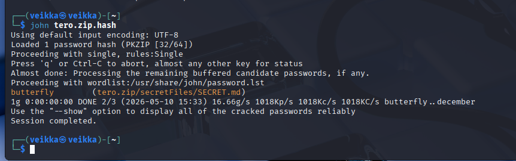

Sieltä tuli salasana: butterfly

Testaus

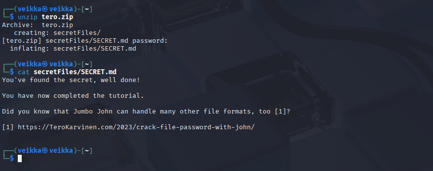

Ja näin John the ripper korkkaus salasana suojatun zip-tiedoston

## c) Tiedosto. Tee itse tai etsi verkosta jokin salakirjoitettu tiedosto, jonka saat auki. Murra sen salaus. (Jokin muu formaatti kuin aiemmissa alakohdissa kokeilemasi).

Mediumin artikkelissa luki, että john voi korkkaa MS office tiedostoja. Tein libreofficessa tiedoston, tallensin sen .docx ja laitoin siihen salasanan password123

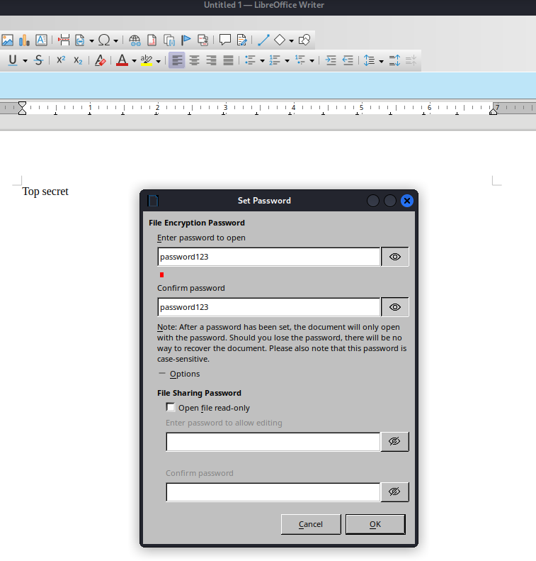

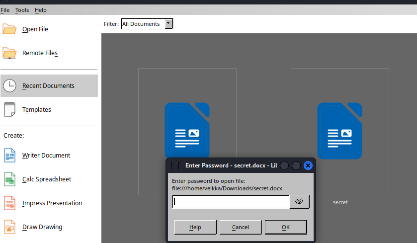

Kyseessä on siis MS office tiedostomuoto niin pitää käyttää sille oikeata työkalua, office2john

Tiivisteen ottaminen

    office2john secret.docx > secret.docx.hash

Tiivisteen korkkaaminen

    john secret.docx.hash

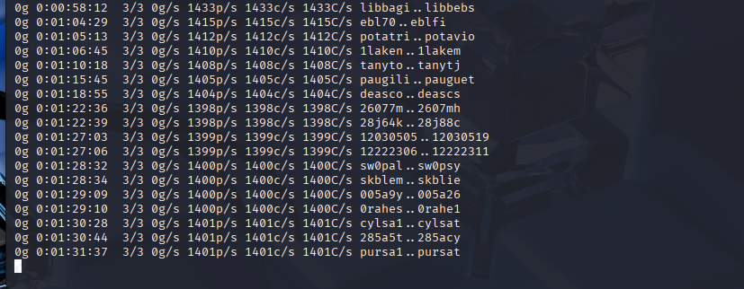

Prosessisssa on mennyt yli 90 minuuttia joten vaihdan salasanaa helpommaksi Johnille

Se käyttää oletuksena salasanalistaa /usr/share/john/password.lst

kävin katsomassa listaa

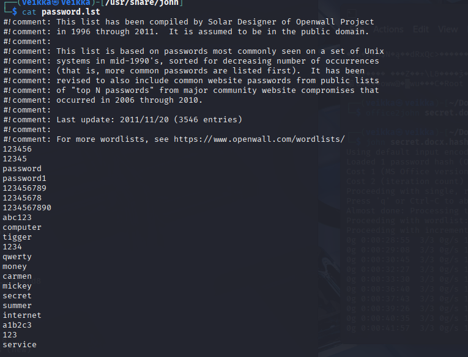

Siellä oli paljon helppoja salasanoja, valitsin niistä salasana 123 uudelle .docx tiedostolle.

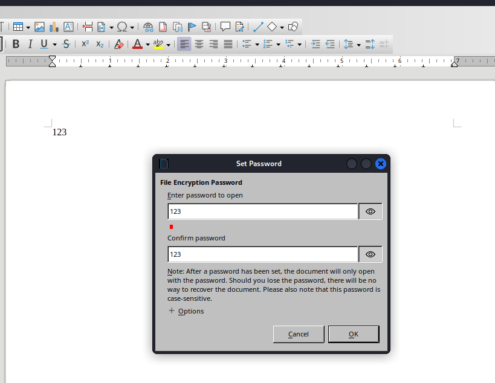

Toistin askeleet

Tiivisteen ottaminen

    office2john 123.docx > 123.docx.hash

Tiivisteen korkkaaminen

    john 123 .docx.hash

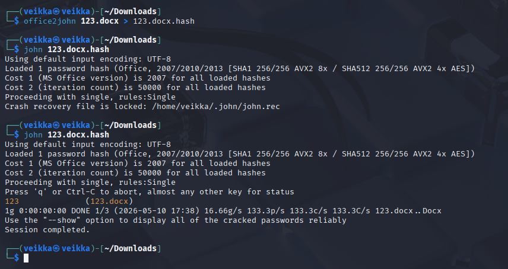

Nyt onnistui ja vielä tosi nopeasti. Ensimmäinen yritys olisi onnistunut jossain vaiheessa jos ei olisi virtuaalikonetta ja olisi kunnon sanakirja, mutta sanakirjoista myöhemmin lisää.

## d) Tiiviste. Tee itse tai etsi verkosta salasanan tiiviste, jonka saat auki. Murra sen salaus. (Jokin muu formaatti kuin aiemmissa alakohdissa kokeilemasi. Voit esim. tehdä käyttäjän Linuxiin ja murtaa sen salasanan.)

Tein SHA256 tiiviisteen sanasta password. Siirryin sitten korkkaamiseen. Kuten edellä mainittu ensimmäinen vaihe on tiivisteen tunnistaminen.

    hashid -m 5e884898da28047151d0e56f8dc6292773603d0d6aabbdd62a11ef721d1542d8

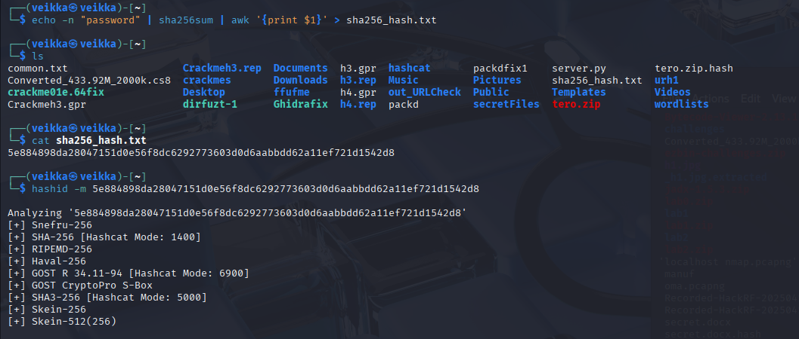

SHA256 oli top 3 joukossa kuten odotettu

Korkkasin sen samalla tavalla (SHA256 mode 1400 siksi -m 1400)

    hashcat -m 1400 5e884898da28047151d0e56f8dc6292773603d0d6aabbdd62a11ef721d1542d8 rockyou.txt solved

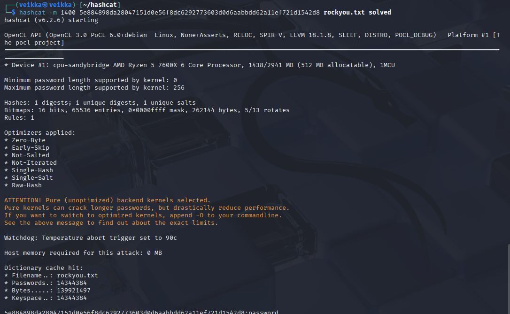

 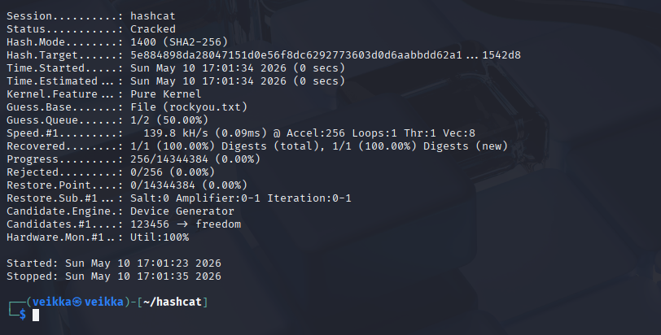

## e) Sanakirja. Oman sanakirjan teko parantaa onnistumismahdollisuuksia. Demonstroi, kuinka teet oman sanakirjan hashcat:n tai john:iin.

Vinkeissä puhuttiin cewl työkalusta, joten päätin kokeilla sitä. 

    cewl https://tryhackme.com -d 2 -m 5 -w oma_sanakirja.txt

-d: Kuinka syvälle ja laajan sanakirjan cewl tekee

-m: minimi kirjain määrä 

-w: mihin tiedostoon sanakirja tallentuu

Cewl teki tälläisen tryhackme.com sivulta

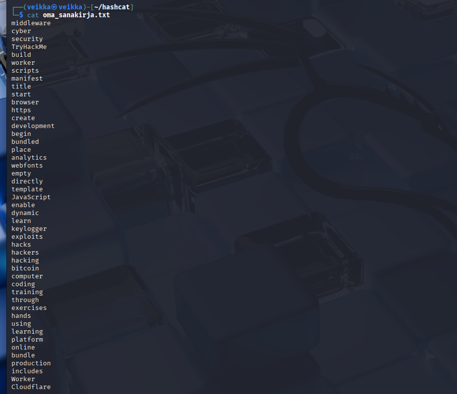

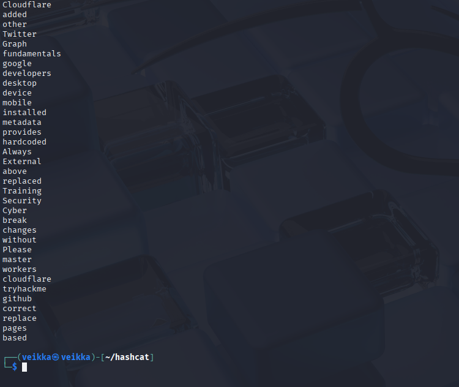

Se on aika karu, joten halusin lisätä siihen enemmän variaatiota Mentalist-ohjelmalla.

    sudo apt update
    sudo apt install git python3 python3-pip python3-tk

    git clone https://github.com/sc0tfree/mentalist.git
    cd mentalist

    python3 -m mentalist

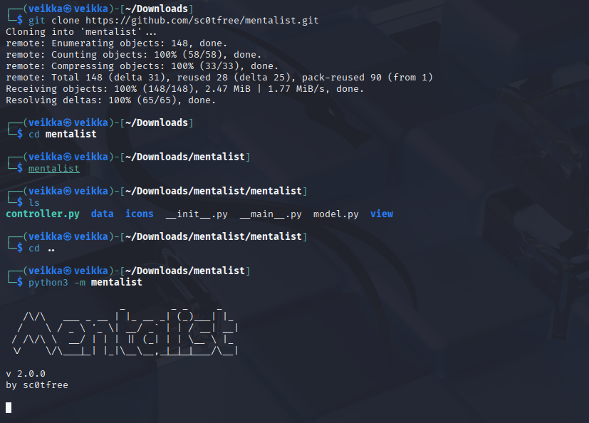

Sinne pystyy lataamaan oma sanalistan ja tehdä lisäyksiä

Oman sanakirjan saa ladattua Mentalistiin Base word:in vieressä olevasta +  merkistä custom file -> lataa oma tiedosto

Esimerkiksi case ja append 

case lisää sanat isoilla ja pienillä kirjaimilla

append lisää numeroita ja erikoismerkkejä

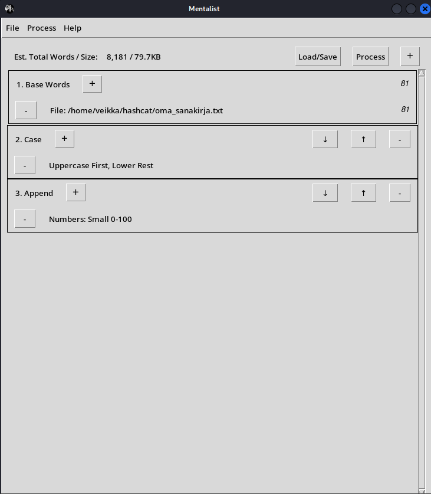

Tallentemalla päivitetyn sanalistan Process -> full wordlist

Menin katsomaan uutta listaa grepillä

    grep -ni "cloudflare" mentalist_wordlist.txt

Mentalist oli asetuksilla luonut esimerkiksi Cloudflaresta 1-100 automaattisesti listan

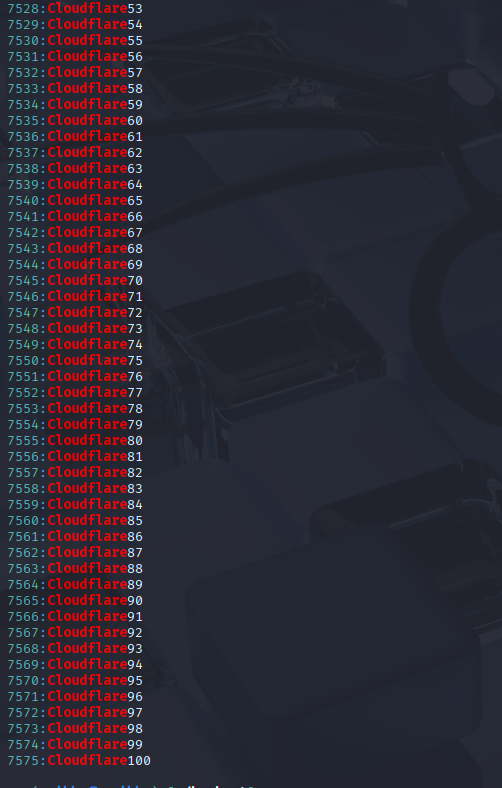

## f) Hash rules. Näytä esimerkki HashCatin sääntöjen käytöstä (rules).

Hashcatillä voi asettaa sääntöjä salasanojen kokeilulle. Esimerkiksi jos salasana on Password123, mutta listassa on vain Password ja Password1, niin hashcat ei voi arvata salasanaa. Sille voi asettaa sääntö kuten lisää arvatun sanan loppuun 2 tai 1 ja 2 ja 3 tai aloita sana isolla kirjaimella. 

Tein pienen sanalista base_words ja rules tiedoston

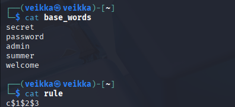

base_words: pieni esimerkki sanalista

rules: c$1$2$3

c: aloittaa sanan isolla kirjaimella
$: jatkaa
1: Lisää numeron yksi sana loppuun

Tämä jatkuu kunnes päästään numeroon kolme, jolloin se lopettaa

Tämän säännön mukaan siis sanoista tulee

password → Password123
admin    → Admin123
summer   → Summer123

Testaus:

    hashcat -m 1400  rule_demo_hash.txt base_words -r rule

Tässä uutena vain tuo -r joka antaa hashcatilla säännön jota noudattaa

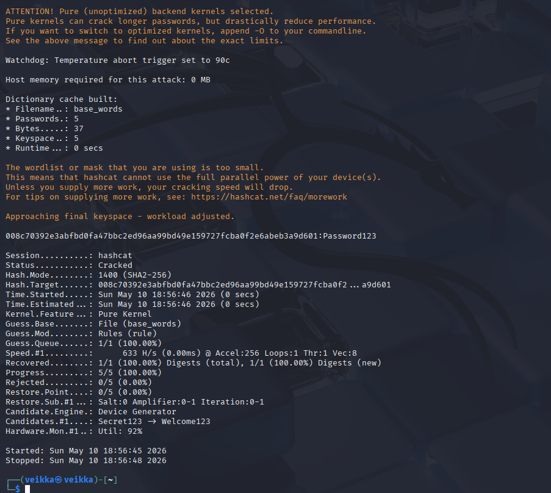

Näin siis Hashcatilla voi korkata salasanan vaikka se ei ole sanalistassa

## g) Lippuvalmistelu. Valmistele kone ensi viikon lipunryöstöön. Tästä kohdasta ei tarvita kattavaa raporttia, riittää pelkkä luettelo siitä, miten ratkaisit allaolevat kysymykset. Jos sinulla on esimerkiksi valmis, toimiva Kali VM tavallisella PC:llä, tässä ei tarvitse tehdä juuri mitään.

Aion asentaa tuoreen Kali Linux virtuaalikoneen ja hoitaa kaikki sillä. Lähteinä aioin käyttää googlea ja man sivuja

## Lähteet

https://terokarvinen.com/tunkeutumistestaus/#h7-toukokuu2026

https://medium.com/@offensotvmrd/zip-password-cracking-using-john-the-ripper-3c1063c204d9

cewl man sivut
